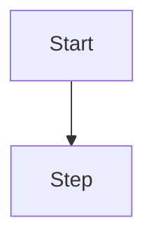
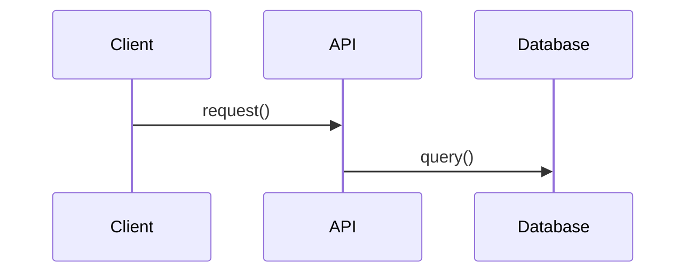
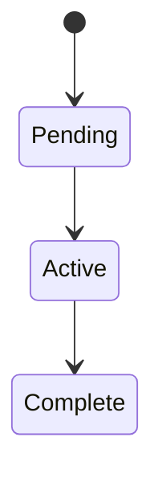
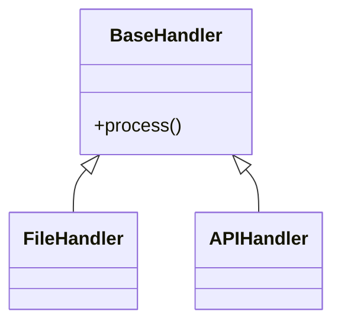

# Session End - Progress Recording

Record progress at the end of a development session with proper git workflow and documentation.

## Git Workflow Best Practices

### Branch Strategy
- **Main branch**: `main` — primary development branch for this project
- **Development branches**: Use `dev-*` branches for larger feature work
  - Name branches after the feature or area (e.g., `dev-auth`, `dev-api`, `dev-ui`)
- **Merge to `main`** at milestone completion when tests pass and feature is complete
- Tag milestones (e.g., `v1.0.0`, `v1.1.0`)

### Commit Strategy
- **Commit often** directly to current branch
- Use `[area]` tag format:
  - `[util]` - Utility module changes
  - `[config]` - Configuration changes
  - `[cli]` - CLI and entry point changes
  - `[doc]` - Documentation updates
  - `[fix]` - Bug fixes
  - `[refactor]` - Code restructuring
  - `[test]` - Test additions/changes
  - `[infra]` - CI, packaging, workflow infrastructure
- Examples:
  - `[util] Add retry logic to slack.py`
  - `[config] Add max_retries to project.yaml`
  - `[fix] Correct keep_index logic in update_excel_workbook`

## Knowledge Graph: Session Documents as Edges

Session docs don't just record what happened — they create edges to permanent documents, forming a navigable knowledge graph. A session that implements a plan, references a design doc, and follows a previous session creates three traversable links.

### Relationship Types

| Relationship | When to Use |
|--------------|-------------|
| `**Documents**:` | Link to system/design docs this session touched (most common) |
| `**Implements**:` | If following an implementation plan |
| `**References**:` | Other docs consulted during work |
| `**Follows**:` | If continuing a previous session |
| `**Completes**:` | Phase or milestone this session finishes |
| `**Requires**:` | Unresolved dependency blocking future work |
| `**Cites**:` | External reference, algorithm source, or prior art |

### Session Header Template

```markdown
# Session: Descriptive Title

**Date**: YYYY-MM-DD
**Branch**: main
**Tags**: #session #domain #activity

**Documents**: [pillars.md](../design/pillars.md) — Design principles this session touched
**Implements**: [plan.md](../plans/plan_name.md) — Plan being followed (if any)
**References**: [other.md](../background/other.md) — Docs consulted during work
**Follows**: [prev_session.md](20260220_prev.md) — Previous session (if continuing)
**Completes**: Phase N — Name (from project.yaml)
**Requires**: [blocker.md](../design/blocker.md) — Unresolved dependency (if any)
**Cites**: [source.md](../background/source.md) — External reference or algorithm source

---
```

Only include the relationship fields that apply to this session.

## Documentation Protocol

### File Naming
- Format: `docs/sessions/YYYYMMDD_descriptive_filename.md`
- Example: `docs/sessions/20260310_add_semantic_scholar_source.md`

### Tags — Canonical Taxonomy

| Category | Tags | Use for |
|----------|------|---------|
| **Type** | `#session` | Always include for session logs |
| **Domain** | `#util` `#config` `#cli` `#infra` | What area of the project |
| **Status** | `#complete` `#in-progress` | Work completion state |
| **Pillars** | `#pillar-1` through `#pillar-5` | Design principle relevance |

### Session Body Structure

```markdown
## Summary

[Brief overview of work completed in this session]

## Changes Made

- [List of key changes]
- [New effects or engine features added]
- [Files modified with brief description]

## Architecture/Flow Diagrams

[Include diagrams if they help explain what changed]

## Technical Details

### Key Decisions
- [Important technical decisions made]
- [Trade-offs considered]

## Next Steps

- [ ] [Outstanding tasks]
- [ ] [Future improvements]
- [ ] [Known issues to address]

## Notes

[Any additional context, gotchas, or important observations]
```

**Tip**: Search sessions with `grep -r "#source" docs/sessions/` or `grep -r "Documents.*pipeline" docs/sessions/` to find related work.

## Session End Checklist

When you invoke this skill, I will guide you through:

1. **Review uncommitted changes**
   - Check `git status`
   - Review `git diff` to ensure all changes are intentional

2. **Pre-Code Check (PCC)**
   - Secrets check — no API keys, passwords, tokens
   - Tests pass — run `pytest`
   - Debug artifacts — no `print()`, `breakpoint()` left in code

3. **Commit workflow**
   - Stage relevant files
   - Create descriptive commit message using `[area]` tags
   - Push to current branch

4. **Update project status**
   - `config/project.yaml` — update version and phase status
   - Include in commit (amend if needed)

5. **Evaluate merge readiness**
   - Assess if this represents a major functional milestone
   - If yes, prepare for merge to main and tag
   - If no, continue on current branch

6. **Generate session documentation**
   - Create properly formatted `YYYYMMDD_*.md` file in `docs/sessions/`
   - Use knowledge graph header with appropriate relationship fields
   - Include appropriate diagrams (ASCII for simple, Mermaid for complex)
   - Document key changes, decisions, and next steps

7. **Verify documentation quality**
   - Ensure date, branch, and tags are accurate
   - Validate that relationship edges point to real files
   - Check that all body sections are complete

## Diagram Guidelines

### When to Use ASCII
- Simple linear flows
- Component relationships
- Directory structures
- Basic state transitions

### When to Use Mermaid
- Complex decision trees
- Multi-step workflows with conditionals
- State machines
- Class diagrams
- Sequence diagrams
- Entity relationships

### Mermaid Diagram Types

**Flowcharts** (workflows, decision trees):


**Sequence Diagrams** (API interactions, data flows):


**State Diagrams** (status flows):


**Class Diagrams** (data models, class hierarchy):


## Best Practices Summary

- Commit often, merge to main at milestones
- Use `[area]` tags in every commit message
- Session docs create knowledge graph edges — use relationship fields intentionally
- Only include relationship fields that actually apply (don't pad with empty links)
- Use the right diagram type for the complexity
- Include status and next steps in every session doc
- Keep session documentation in `docs/sessions/` with dated filenames
