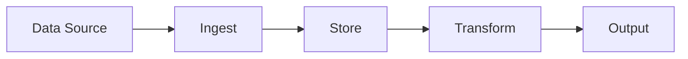
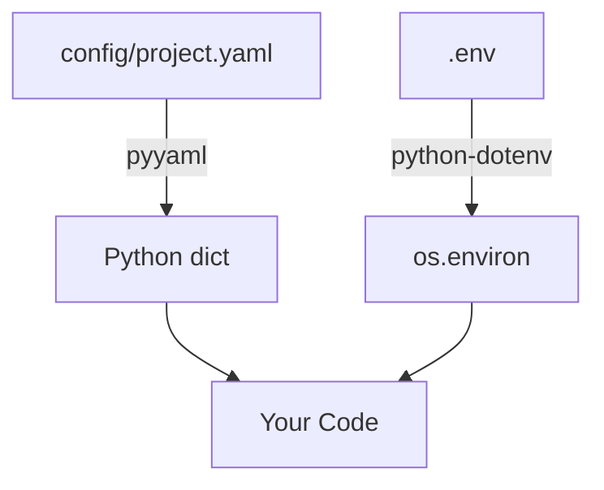
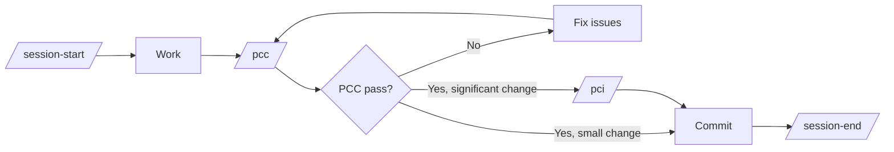

# From Template to Project

**Audience**: A developer who just cloned this repo and needs to ship something real.

**What this document is**: A concrete playbook for turning the template into your project. Read it once, then use the Day-1 checklist to get your hands dirty.

---

## 1. Overview

This template gives you a working Python project scaffold with zero wasted code. What you get on clone:

- `src/myproject/` package with utility modules and a decision science subpackage
- `pyproject.toml` with optional dependency groups (install only what you need)
- pytest infrastructure with 189 tests across 8 test files (53% coverage)
- Claude Code workflow: session commands, four prepositioned agents, PCC/PCI quality gates
- Design pillars, roadmap, and task escalation framework ready to fill in

What you do **not** get: a README or a CI pipeline. Those gaps are documented in Section 9.

**Why it exists**: Starting a Python project from scratch means making a dozen identical decisions every time — how to structure packages, how to handle optional deps, whether to use src-layout, how to set up logging, how to run parallel tasks. This template makes those decisions once so you can focus on the domain.

**The model**: `config/project.yaml` is the runtime source of truth. `pyproject.toml` is the packaging source of truth. They don't overlap. Everything else — agents, commands, skills — is workflow infrastructure that guides how you work, not what you build.

---

## 2. Day-1 Checklist

Do these steps in order. Every file that needs changing is listed.

### Step 1: Rename the package

Replace `myproject` with your project name everywhere. Pick a name that is a valid Python identifier (lowercase, underscores, no hyphens).

```bash
# In the terminal — replace "newname" with your actual project name
NEW=newname

# Rename the source directory
mv src/myproject src/$NEW
```

Files that contain `myproject` and need to be updated:

| File | What to change |
|------|----------------|
| `pyproject.toml` | `name = "myproject"` → `name = "newname"` |
| `pyproject.toml` | `"myproject[dev,excel,...]"` in `all` group → `"newname[...]"` |
| `config/project.yaml` | `name: "myproject"` → `name: "newname"` |
| `config/project.yaml` | `source: "src/myproject"` → `source: "src/newname"` |
| `CLAUDE.md` | All occurrences of `myproject` in paths and examples |
| `.claude/commands/pci.md` | `src/myproject/utils/*.py` path references |
| `.env.example` | Comments referencing `src/myproject/utils/` |
| `src/newname/utils/*.py` | Module docstrings — none reference `myproject` directly, but verify |
| `tests/conftest.py` | Any import of `myproject` |
| Any test files | `import myproject` or `from myproject` |

### Step 2: Update project metadata

In `pyproject.toml`:
```toml
[project]
name = "newname"
version = "0.1.0"
description = "What your project actually does"
# Add these if you want them:
authors = [{name = "Your Name", email = "you@example.com"}]
```

In `config/project.yaml`:
```yaml
project:
  name: "newname"
  version: "0.1.0"
  description: "What your project actually does"
```

### Step 3: Set up the environment

```bash
python3 -m venv .venv
source .venv/bin/activate
pip install -e ".[dev]"          # Base + test deps only
cp .env.example .env             # Then fill in any secrets you need
```

Install optional deps for any utilities you're keeping:
```bash
pip install -e ".[excel]"        # If keeping excel.py
pip install -e ".[slack]"        # If keeping slack.py
pip install -e ".[database]"     # If keeping database.py (fix it first — see Section 9)
pip install -e ".[weights]"      # If keeping weights.py
```

### Step 4: Strip what you don't need

Remove unused modules, their tests, and their dependency groups. Be ruthless — see Section 3 for guidance on what to keep vs. remove.

```bash
# Example: removing geo.py
rm src/$NEW/utils/geo.py
rm tests/unit/test_geo.py
# Remove the dep group from pyproject.toml if one exists
```

Then clean up template artifacts:

| Action | Why |
|--------|-----|
| Delete `docs/sessions/*.md` | Template session history, not yours |
| Delete `docs/design/from_template_to_project.md` | You've read it — it's template scaffolding |
| Reset `docs/tasks.md` to empty Active/Blocked/Completed sections | Template tasks, not yours |
| Clean `.claude/README.md` of template-specific wording | Update agent roster and scope matrix for your project |
| Remove the `all` dep group from `pyproject.toml` if it points to groups you deleted | Dead indirection |
| Preserve `.claude/commands/` and `.claude/skills/` intact | These carry workflow logic, not template scaffolding |

### Step 5: Verify tests pass

```bash
pytest
```

You should see all remaining tests pass. If anything fails, the rename step missed something — re-check all `myproject` references.

### Step 6: Update the task list

Create `docs/tasks.md` if it doesn't exist (run `/task list` in Claude Code to generate the stub). Add your first real tasks here.

### Step 7: Initial commit

```bash
git add -A
git commit -m "[config] Rename myproject → newname, update metadata"
```

This is your project's starting line. Everything before this point is template. Everything after is yours.

---

## 3. What to Keep, Evaluate, or Remove

Every module is optional unless your project actually needs it. Be ruthless — dead code in a template becomes dead code in your project.

### Standards (follow everywhere)

**`pathlib`** — The template uses `pathlib.Path` exclusively for all filesystem operations. No `os.path` anywhere. Follow this convention in your project — use `Path` for construction, `/` for joining, `.read_text()` / `.write_text()` for I/O.

### Keep (universal)

**`logger.py`** — Every project needs logging. Use the convenience function for quick setup:

```python
from myproject.utils.logger import get_logger

logger = get_logger("myapp")                          # Console-only
logger = get_logger("myapp", "logs/")                 # Console + file
logger = get_logger("myapp", datefmt="%H:%M:%S")      # Custom time format
```

Features: colored console output (auto-detects TTY), timezone-aware timestamps, date-stamped log files, duplicate handler prevention on re-import. Console-only mode (no `log_dir`) is ideal for scripts and notebooks. The class-based API `LoggerSetup.setup_logger()` is also available.

One caveat: the `Formatter.converter` assignment is a global mutation that affects all formatters in the process. If you set up two loggers with different timezones, the last one wins. Fine for most projects; document the constraint if your project runs multiple loggers concurrently.

### Evaluate (domain-dependent)

**`geo.py`** — Keep if your project involves geographic data. Pure stdlib, no deps, correct haversine and bearing formulas. Drop it if you're not doing geo work.

**`parallel.py`** — Keep if you need multiprocessing. Two patterns: producer-consumer for heterogeneous tasks, starmap for homogeneous batch work. Well-designed default worker counts. Drop it if your workload is single-threaded.

**`weights.py`** — Keep if you're doing multi-criteria decision analysis or ranking. Three weighting methods (SMARTER, rank reciprocal, rank sum) with tie handling. Requires `numpy` + `pandas` (`pip install -e ".[weights]"`). Drop it if you're not doing MCDA work.

**`excel.py`** — Keep if you're generating Excel reports. Handles DataFrame-to-table formatting cleanly. Requires `pandas`, `openpyxl`, `xlsxwriter`. Drop it if you're not generating Excel files.

**`slack.py`** — Keep if you need Slack notifications. Thin wrapper — the whole module is 37 lines. Easy to understand and extend. Requires `slack-sdk`. Drop it if you're not posting to Slack.

**`database.py`** — Keep if you need PostgreSQL + JSONB storage. Fully synchronous implementation. Requires `psycopg`. Drop it if you're using a different database or ORM.

**`decision_science/`** — Keep if you're doing multi-criteria decision analysis, weighted scoring, or alternative ranking. A complete MAUT subpackage: 7 value functions, `MAUTScorer` with `from_yaml()`, sensitivity analysis (OAT, Monte Carlo, scenario comparison), visualization (radar, tornado, heatmap). Includes a `decision-scientist` agent and team template. Requires `numpy` (required dep), `matplotlib` (optional for visualization). Drop the entire subpackage if you're not doing MCDA work.

### Consider removing

**`math_utils.py`** — The module itself acknowledges that `math.comb()` is in the stdlib since Python 3.8. These implementations are kept "for educational reference." If you're not doing combinatorics work or teaching, this is dead weight. Remove the module and its tests.

### Pattern: How to remove a module

1. Delete `src/newname/utils/the_module.py`
2. Delete `tests/unit/test_the_module.py` (if it exists)
3. Remove the corresponding optional dep group from `pyproject.toml` (if it exists only for that module)
4. Remove references from `CLAUDE.md`

---

## 4. Defining Your Project

### Filling in `config/project.yaml`

Phase 1 is already marked complete — that's the template foundation. Define your actual phases starting with Phase 2:

```yaml
build_phases:
  phase_1:
    name: "Foundation"
    status: "complete"
    deliverable: "Project template with utility modules and dev workflow"
  phase_2:
    name: "Core Feature X"          # Be specific — name the thing
    status: "in_progress"
    deliverable: "Working X that does Y, with Z test coverage"
  phase_3:
    name: "Integration"             # Can be vague if it's far out
    status: "not_started"
    deliverable: "TBD"
```

Good deliverables are concrete and verifiable. Bad: "Backend complete." Good: "API endpoints for user auth, with pytest suite at >80% coverage."

### Writing design pillars that work

The template's three pillars (`Simplicity First`, `Shift-Left Testing`, `Config-Driven`) are examples. Replace them with your project's actual constraints. The format in `docs/design/pillars.md` is the right structure:

- **Principle**: One sentence rule
- **Why**: Why this matters _for this project specifically_
- **In practice**: Concrete guidelines
- **Violation example**: A real code smell that breaks this pillar

The violation example is the most important part. Without it, pillars are aspirational. With it, they're a code review checklist.

Aim for 3-5 pillars. More than 5 means you haven't prioritized.

### Setting up the task list

Run `/task add <description>` or edit `docs/tasks.md` directly. Structure for the initial list:

```markdown
## Active

- [ ] [P1] Fix database.py sync/async mismatch — owner: unassigned
- [ ] [P1] Write README.md — owner: unassigned
- [ ] [P2] Add tests for geo.py — owner: unassigned
- [ ] [P2] Add tests for logger.py — owner: unassigned

## Blocked

## Completed
```

P1 = do now, P2 = do soon, P3 = backlog. Assign when ownership is clear. Keep it honest — a task list with 40 open items is noise.

---

## 5. Your First Design Doc

Before writing code for your project's first feature, write a design doc. This doesn't need to be long — it needs to answer the questions that will otherwise be answered implicitly by whoever writes the first file.

Use this structure in `docs/design/FEATURE_NAME.md`:

---

### Problem Statement

_One paragraph. What problem exists? Who has it? What happens today without a solution?_

> Example: Research analysts manually compile weekly briefings from 12 data sources. The process takes 4 hours and produces inconsistent output because each analyst structures differently.

### Scope

**In scope**:
- [ ] Feature A
- [ ] Feature B
- [ ] Automated test suite for the above

**Out of scope**:
- Feature C (future phase)
- Feature D (separate system)

### Key Decisions to Make Before Coding

List the decisions that will shape the architecture. Don't leave these implicit.

| Decision | Options | Recommended | Rationale |
|----------|---------|-------------|-----------|
| Storage layer | SQLite / PostgreSQL / files | PostgreSQL | Need JSONB and concurrent writes |
| Sync vs async | sync / async | sync | No I/O concurrency needed in v1 |

### Architecture Sketch



### Success Criteria

How will you know when this phase is done?

- [ ] Feature A works end-to-end with real inputs
- [ ] Test coverage for new modules > 80%
- [ ] Design pillars not violated (run `/pci`)

---

Writing this doc surfaces disagreements before they become bugs. If you can't fill it in, you don't understand the problem well enough to write the code.

---

## 6. Configuration Deep Dive

### How config flows



YAML is for structured config (phases, paths, thresholds, toggles). Environment variables are for secrets and deployment-specific values. They serve different purposes and never overlap.

### Reading config in Python

```python
import yaml
from pathlib import Path

config_path = Path(__file__).parent.parent.parent / "config" / "project.yaml"
with config_path.open() as f:
    config = yaml.safe_load(f)

# Access values
project_name = config["project"]["name"]
phase_status = config["build_phases"]["phase_2"]["status"]
```

### Reading env vars

```python
from dotenv import load_dotenv
import os

load_dotenv()  # Loads .env into os.environ
db_host = os.environ.get("DB_HOST", "localhost")
```

Call `load_dotenv()` once at your application's entry point, not in every module.

### Adding new config

Add to `config/project.yaml`:
```yaml
# Your new section
my_feature:
  max_retries: 3
  timeout_seconds: 30
  enabled: true
```

Then read it from Python. Don't add new YAML files — one config file keeps things findable. The `config/` directory growing to 10 files is a maintenance burden.

### Adding new optional dependencies

In `pyproject.toml`:
```toml
[project.optional-dependencies]
myfeature = [
    "some-package>=1.0",
]
# Update the "all" group:
all = [
    "myproject[dev,excel,slack,database,weights,myfeature]",
]
```

Then document the install command in `CLAUDE.md`'s Quick Commands section.

### What .env.example should contain

Every key your code reads from `os.environ`, with a dummy value and a comment explaining what it is. This file is committed. The actual `.env` is never committed. Keep them in sync — if you add a new env var, add it to `.env.example` immediately.

---

## 7. Testing Strategy

### The pattern to follow

The template ships with 189 tests across 8 test files. Key patterns:

- Tests are in `tests/unit/` for unit tests, `tests/integration/` for integration tests
- Test file names match module names: `test_math_utils.py` tests `math_utils.py`
- Each function gets at least one happy-path test and one edge case
- No test should depend on network, filesystem, or execution order unless that's exactly what's being tested

### Handling optional dependencies in tests

For modules that require optional deps, gate with `pytest.importorskip`:

```python
# At the top of test_excel.py
pd = pytest.importorskip("pandas", reason="pandas required for excel tests")
openpyxl = pytest.importorskip("openpyxl", reason="openpyxl required for excel tests")

# Then write your tests normally
def test_excel_style_index():
    from myproject.utils.excel import excel_style_index
    assert excel_style_index(1, 1) == "A1"
    assert excel_style_index(1, 26) == "Z1"
    assert excel_style_index(1, 27) == "AA1"
```

This skips the entire test file gracefully when deps aren't installed, rather than failing.

### Priority order for new tests

Write tests in this order (easiest to hardest):

1. Pure functions with no side effects (geo.py, math_utils.py)
2. Functions with file I/O (logger.py — use `tmp_path` fixture)
3. Functions with external deps gated by importorskip (excel.py, weights.py)
4. Functions requiring mocks (slack.py with `unittest.mock.patch`)
5. Database / multiprocessing (database.py after fixing, parallel.py)

### Running with coverage

Coverage is configured in `pyproject.toml` under `[tool.coverage.run]` and `[tool.coverage.report]`:

```bash
pytest --cov                        # Coverage table with missing lines
pytest --cov --cov-report=html      # HTML report in htmlcov/
```

### Coverage target

The template ships at 53% coverage with a `fail_under = 50` threshold. Ratchet this up as you add tests — aim for 80%+ on modules you actively develop. Modules behind optional dependencies (excel, slack, database) will show 0% unless those extras are installed.

---

## 8. Dev Workflow Guide

### The session cadence



**session-start**: Load project config, review last session doc, check task list, verify tests pass. Don't skip this — it takes 30 seconds and prevents you from working in the wrong context.

**session-end**: Git status review, PCC, commit with `[area]` tag, update tasks, write session doc. The session doc in `docs/sessions/YYYYMMDD_*.md` is your audit trail. Future-you will thank you.

### PCC vs PCI

| | PCC | PCI |
|---|---|---|
| **Speed** | Seconds | Minutes |
| **Checks** | Secrets, tests, debug artifacts, git state | All of PCC + type hints, docstrings, error handling, test coverage |
| **When** | Before every push | Before merge/PR, or when PCC passes but you want confidence |
| **Decision** | Pass/fail, no judgment | Context-aware findings with recommendations |

Run PCC always. Run PCI when the diff is large or touches core logic.

### Task escalation: when to promote

Don't over-plan. Start with a task. Promote only when complexity demands it.

| Situation | Level |
|-----------|-------|
| Clear action, one session, 1-3 files | Task |
| Multi-step, needs pass/fail criteria | TCS |
| Multiple phases, design decisions, spans sessions | CONOP |
| Strategy decided, executing sequentially | OPORD |

The decision tree from `/task`:
```
Can I explain this in one sentence?      → Yes: Task
Do I need pass/fail criteria?            → Yes: TCS minimum
Are there design decisions to make?      → Yes: CONOP
Is the strategy decided, just execute?   → Yes: OPORD
```

Erring toward CONOP for anything uncertain is better than erring toward Task. A task that balloons into a 3-session effort without a plan is chaos.

### Agent usage

| Team size | When | Template |
|-----------|------|----------|
| Solo | Config changes, small bug fixes | Just you |
| 2 agents | Bug fix with tests | `.claude/teams/bug-fix.md` |
| 3 agents | New utility module | `.claude/teams/feature-development.md` |
| Review | Code review pass | `.claude/teams/code-review.md` |

Read `.claude/README.md` before deploying a team. The key rule: every file has exactly one owner. If two agents need to touch the same file, restructure the task.

Add domain-specific Level 1 agents as your project grows. Level 0 agents (test-runner, code-reviewer, python-prototyper) are portable — don't modify them.

### Commit message conventions

Use `[area]` tags as defined in `session-end.md`:

```
[util] Add retry logic to slack.py
[config] Add max_retries to project.yaml
[doc] Write initial design doc for feature X
[fix] Correct keep_index logic in update_excel_workbook
[test] Add tests for geo.py haversine and bearing
[infra] Add GitHub Actions CI workflow
```

---

## 9. Known Issues & First Fixes

Remaining gaps the next team inherits.

### Informational: No README.md

There's no `README.md` at the project root. `CLAUDE.md` is for Claude Code, not for humans on GitHub. A new team member cloning the repo has no entry point.

**Fix**: Write a minimal README covering: what the project does, how to set up the environment, how to run tests, and how to contribute.

### Informational: No CI pipeline

No GitHub Actions workflow exists. Tests run locally but not on push or PR.

**Fix**: Add `.github/workflows/ci.yml` with pytest and coverage check.

### Informational: Optional-dep modules have 0% coverage

`database.py`, `excel.py`, `parallel.py`, `slack.py`, and `weights.py` have no test coverage because their dependencies aren't in the base install. If you keep any of these modules, add tests gated with `pytest.importorskip`.

### Previously fixed (for reference)

These issues existed in earlier versions of the template and have been resolved:

- **database.py sync/async mismatch** — Converted to fully synchronous (2026-03-17)
- **excel.py keep_index inverted logic** — Fixed `if not keep_index` → `if keep_index` (2026-03-31)
- **session-end.md paperboy content** — Scrubbed domain-specific tags (2026-03-17)
- **SKILLS_FRAMEWORK.md paperboy references** — Replaced with generic examples (2026-03-17)
- **Dead conftest.py fixtures** — Removed unused `sample_data` and `project_root` (2026-03-31)
- **Coverage config missing** — Added `[tool.coverage.run/report]` to pyproject.toml (2026-03-31)
- **Test coverage at 4%** — Now at 53% with 189 tests (2026-03-31)

---

## 10. Common Pitfalls

**Keeping modules you don't need.** Dead code accumulates debt. If your project isn't doing geo work, delete `geo.py` on Day 1. Removing it later is harder.

**Not writing the first design doc.** The impulse to jump straight into code is strong when you have a working scaffold. Resist it. Thirty minutes writing the problem statement and scope catches half the architecture mistakes before they're written.

**Skipping session-start.** It feels like overhead until the session where you spend 20 minutes re-orienting because you forgot what was done last time.

**Letting the task list grow unchecked.** A task list with 40 items is not a task list — it's a guilt log. Keep active tasks under 10. Promote complex work to plans. Archive stale tasks.

**Running PCI instead of PCC for small changes.** PCC is cheap. Run it on every push. Save PCI for big diffs and pre-merge reviews.

**Treating design pillars as aspirational rather than enforceable.** Pillars only work if PCI checks against them and code review flags violations. If your pillar says "every new component includes tests" and a PR adds 200 lines with zero tests, that's a violation, not a missed ideal.

**Not updating .env.example when adding new secrets.** Future team members will be missing env vars with no indication of what's needed. `.env.example` is documentation. Keep it current.
