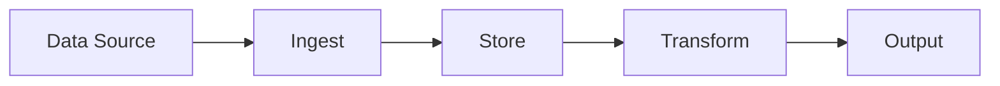
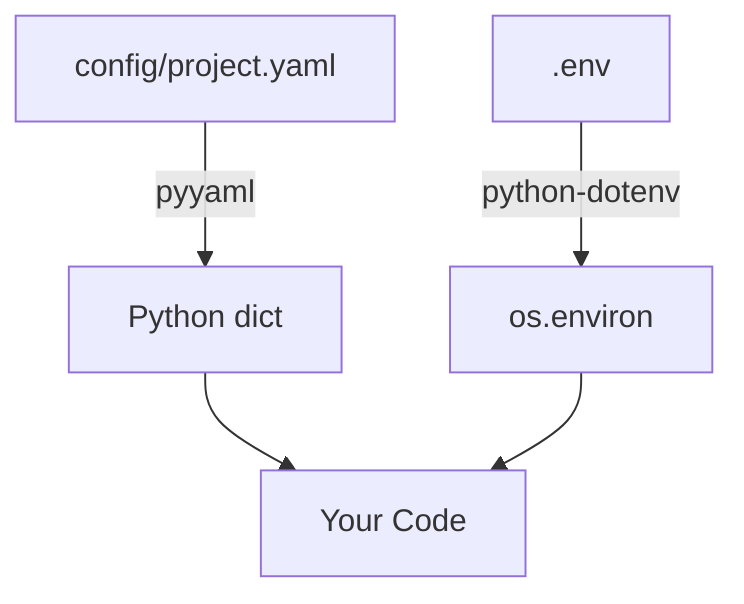
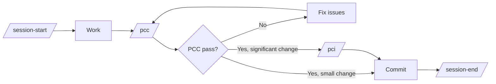

# From Template to Project

**Audience**: A developer who just cloned this repo and needs to ship something real.

**What this document is**: A concrete playbook for turning the template into your project. Read it once, then use the Day-1 checklist to get your hands dirty.

---

## 1. Overview

This template gives you a working Python project scaffold with zero wasted code. What you get on clone:

- `src/myproject/` package with utility modules and a decision-science subpackage
- `pyproject.toml` with optional dependency groups (install only what you need)
- pytest infrastructure with 192 tests across 9 test files (53% coverage; `fail_under = 50`)
- Claude Code workflow: 6 session commands, **5 prepositioned agents** (proposer, code-reviewer, decision-scientist, python-prototyper, test-runner), PCC/PCI quality gates
- **Doctrine infrastructure**: `LANGUAGE.md` (project glossary), `CONTEXT.md` (one-page project identity), `docs/adr/` (architecture decision records with ADR-0001 as worked example), `docs/session-doc-format.md` (session-doc spec), and a `PostToolUse` audit hook for test-first enforcement
- Skills Framework v2 with 6 portable Level 0 skills in directory form (shift-left-testing, configuration-management, python-venv-management, maintaining-ubiquitous-language, maintaining-project-context, recording-architecture-decisions)
- Design pillars, roadmap, and task escalation framework ready to fill in

What you do **not** get: a CI pipeline. That gap is documented in Section 11.

**Why it exists**: Starting a Python project from scratch means making a dozen identical decisions every time — how to structure packages, how to handle optional deps, whether to use src-layout, how to set up logging, how to run parallel tasks, how to enforce TDD, what vocabulary to use. This template makes those decisions once so you can focus on the domain.

**The model**: `config/project.yaml` is the runtime source of truth. `pyproject.toml` is the packaging source of truth. `CONTEXT.md` is the narrative source of truth (what your project IS). `LANGUAGE.md` is the vocabulary source of truth (what your terms MEAN). They do not overlap. Everything else — agents, commands, skills, hooks — is workflow infrastructure that guides how you work, not what you build.

---

## 2. Day-1 Checklist

Do these steps in order. Every file that needs changing is listed.

### Step 1: Rename the package

Replace `myproject` with your project name everywhere. Pick a name that is a valid Python identifier (lowercase, underscores, no hyphens).

```bash
# In the terminal — replace "newname" with your actual project name
NEW=newname

# Rename the source directory
mv src/myproject src/$NEW

# See every occurrence before substituting (authoritative list):
grep -rln myproject . \
  --exclude-dir=.venv --exclude-dir=.git --exclude-dir=.pytest_cache \
  --exclude-dir=dist --exclude-dir=build --exclude-dir='*.egg-info' \
  --exclude-dir=audits
```

Files that contain `myproject` and need to be updated, grouped by category:

| Category | Files / locations | What to change |
|---|---|---|
| **Source** | `src/$NEW/**/*.py` | Any internal `myproject.*` imports; module docstrings |
| **Tests** | `tests/unit/*.py`, `tests/integration/*.py` | `from myproject...` imports throughout |
| **Packaging** (`pyproject.toml`, 3 locations) | `[project] name = "myproject"`; `[project.optional-dependencies] all = ["myproject[dev,excel,slack,database,weights,decision-science]"]`; `[tool.coverage.run] source = ["src/myproject"]` | Substitute all three |
| **Runtime config** | `config/project.yaml`: `project.name`, `paths.source` | Substitute both |
| **Top-level docs** | `CLAUDE.md`, `README.md`, `CHANGELOG.md`, `LANGUAGE.md`, `CONTEXT.md` | All contain `myproject` references; substitute carefully (do not break the structure of LANGUAGE.md / CONTEXT.md when substituting) |
| **Agent infrastructure** | `.claude/agents/python-prototyper.md` (3 sections: Project Layout, Scope, Shift-Left Testing principle); `.claude/agents/decision-scientist.md` (verify); `.claude/README.md` (Scope Matrix row); `.claude/commands/pci.md`; `.claude/teams/*.md` | Substitute everywhere |
| **The audit hook** (CRITICAL — see §4) | `.claude/hooks/post-tool-shift-left-audit.sh` line ~33: `*/src/myproject/*.py)` | Substitute the package name. **If you skip this, the hook silently does nothing** — see §4 for the bash `case` syntax warning |
| **Environment** | `.env.example` (two comments referencing `src/myproject/utils/slack.py` and `src/myproject/utils/database.py`) | Substitute |
| **Historical docs** | `docs/sessions/*.md`, `docs/reviews/*.md`, `docs/plans/*.md`, `docs/doctrine-updates.md` | These are template history — usually deleted on Day 1 (see Step 5) rather than substituted |

After substitution, run `grep -rln myproject . --exclude-dir=.venv --exclude-dir=.git` once more. If anything remains and it is not a historical doc you intend to delete, the rename is incomplete.

### Step 2: Update project metadata

In `pyproject.toml`:
```toml
[project]
name = "newname"
version = "0.1.0"
description = "What your project actually does"
# Add these if you want them:
authors = [{name = "Your Name", email = "you@example.com"}]
```

In `config/project.yaml`:
```yaml
project:
  name: "newname"
  version: "0.1.0"
  description: "What your project actually does"
```

### Step 3: Set up the environment

```bash
python3 -m venv .venv
source .venv/bin/activate
pip install -e ".[dev]"          # Base + test deps only
cp .env.example .env             # Then fill in any secrets you need
```

Install optional deps for any utilities you're keeping:
```bash
pip install -e ".[excel]"            # If keeping excel.py
pip install -e ".[slack]"            # If keeping slack.py
pip install -e ".[database]"         # If keeping database.py
pip install -e ".[weights]"          # If keeping weights.py
pip install -e ".[decision-science]" # If keeping the decision_science subpackage
```

`jq` is required by the audit hook (`§4`). Install it system-wide:
```bash
command -v jq || sudo apt-get install jq    # Linux
command -v jq || brew install jq            # macOS
```

### Step 4: Strip what you don't need

Remove unused modules, their tests, and their dependency groups. Be ruthless — see §5 for guidance on what to keep vs. remove. The doctrine artifacts (LANGUAGE.md, CONTEXT.md, ADRs, the skills directory) are **not** candidates for removal — they get filled in (see Step 5), not deleted.

```bash
# Example: removing geo.py
rm src/$NEW/utils/geo.py
rm tests/unit/test_geo.py
# Remove the dep group from pyproject.toml if one exists
```

Then clean up template artifacts:

| Action | Why |
|---|---|
| Delete `docs/sessions/*.md` | Template session history, not yours |
| Delete `docs/reviews/*.md` | Template Pass-N audit reports, not yours |
| Delete `docs/plans/*.md` | Template plans (e.g., `decision_science_utility.md`), not yours |
| Delete `docs/design/from_template_to_project.md` | You've read it — it's template scaffolding |
| Reset `docs/tasks.md` to empty Active/Blocked/Completed sections | Template tasks, not yours |
| Reset `CHANGELOG.md` to empty | Template changelog, not yours |
| Delete `docs/doctrine-updates.md` AND `docs/propagation-protocol.md` | **Unless your project will itself serve as a doctrine source to other repos** (rare), these belong to the hub repo only |
| Clean `.claude/README.md` of template-specific wording | Update agent roster and scope matrix for your project |
| Remove the `all` dep group from `pyproject.toml` if it points to groups you deleted | Dead indirection |
| Preserve `.claude/commands/`, `.claude/skills/` (copy with `-r`; directory form), `.claude/hooks/`, `.claude/teams/`, `.claude/agents/` intact | These carry workflow logic, not template scaffolding |

Note that `.claude/skills/session-end.md` does not exist — it was demoted to `docs/session-doc-format.md`. If you saw a reference to it elsewhere, ignore it. Three skills (`shift-left-testing`, `configuration-management`, `python-venv-management`) are now directories — copy with `cp -r`, not `cp`.

### Step 5: Fill in the doctrine artifacts (do not skip)

These files ship as templates. Fill them in now, before they pollute every agent session with `utils`-specific content.

| File | Action |
|---|---|
| `CONTEXT.md` | Replace every section's body with your project's content. Keep section headings (Identity, Mission, Current State, Constraints, Key Relationships, Reading Order, Distinguishing Table). The Constraints section lists `utils`'s Pillars — replace with yours (see §6). |
| `LANGUAGE.md` | Delete the example sections (Decision Science, Agent Framework, Escalation Ladder, Governance & Propagation, Workflow Artifacts). Add 3–5 terms your project actually uses. Structure stays: bold term, one-line definition, `_Avoid:_` synonyms when ambiguity exists. |
| `docs/adr/0001-directory-form-mandatory-for-new-skills.md` | Update the `Decision-maker(s)` field to name your team. The decision itself carries over because you are adopting Skills Framework v2. |
| `docs/design/pillars.md` | Either fill in this template stub with your project's actual pillars OR delete it and rely on `CONTEXT.md` + `config/project.yaml` `design_pillars:` as the canonical home (recommended; less duplication). |

See §3 for what each doctrine artifact is and why it matters.

### Step 6: Configure the test-first audit hook (do not skip)

See §4 for the full procedure and the syntax warning. Minimum steps here:

```bash
# 1. Substitute the path glob in .claude/hooks/post-tool-shift-left-audit.sh
#    Find the case block and replace "myproject" with $NEW.
#    DO NOT use parentheses for multi-package alternation — see §4.

# 2. Make it executable (lost on Windows / core.fileMode=false)
chmod +x .claude/hooks/post-tool-shift-left-audit.sh

# 3. Verify jq is installed (the script needs it)
command -v jq || echo "INSTALL JQ FIRST"

# 4. Add audit dir to gitignore (already there in the template, but verify)
grep -q '^\.claude/audits/$' .gitignore || echo ".claude/audits/" >> .gitignore

# 5. Merge the hooks.PostToolUse block into .claude/settings.json
#    See §4 — do NOT replace the whole file. The block is already correct
#    in the template; you only need to substitute the path glob in the script.

# 6. Smoke test: edit any file in src/$NEW/, then verify the log got a fresh entry
tail -1 .claude/audits/shift-left-violations.log
```

### Step 7: Verify tests pass

```bash
pytest
```

You should see all remaining tests pass. If anything fails, the rename step missed something — re-run the `grep -rln myproject .` and substitute.

### Step 8: Update the task list

Create `docs/tasks.md` if it doesn't exist (run `/task list` in Claude Code to generate the stub). Add your first real tasks here.

### Step 9: Initial commit

```bash
git add -A
git commit -m "[config] Rename myproject → newname; fill in doctrine artifacts; configure audit hook"
```

This is your project's starting line. Everything before this point is template. Everything after is yours.

---

## 3. Doctrine Infrastructure

The 2026-05-19 doctrine cycle added four categories of infrastructure that every project cloned from this template inherits. Unlike utility modules (`geo.py`, `excel.py`), **these are not optional**. They are the foundation for how agents and humans understand your project. You do not remove them; you fill them in for your project.

### LANGUAGE.md — your project's glossary

`LANGUAGE.md` at the repo root is a one-sentence-per-term glossary of your project's domain vocabulary. It prevents agents from using two words for the same thing and stops reviewers from disagreeing about terminology mid-review.

**What to do**: The template ships with the `utils` project's terms (decision science, escalation ladder, governance). Replace the example sections with your project's actual domains. Keep the meta-structure (bold term, one-line definition, `_Avoid:_` synonyms when ambiguity exists). Remove any section that does not apply to your domain.

The `maintaining-ubiquitous-language` skill (`.claude/skills/maintaining-ubiquitous-language/SKILL.md`) handles ongoing maintenance — agents invoke it when new terms emerge or definitions go stale.

**Minimum viable LANGUAGE.md on Day 1**: delete every example section, add 3–5 terms your domain actually uses, ship it. Grow it as your vocabulary stabilizes.

### CONTEXT.md — what your project is

`CONTEXT.md` at the repo root is a one-page narrative covering project identity, mission, current state, key constraints, and the reading order for new contributors and agents. It is the first file any agent or human should read when introduced to your project.

**What to do**: Replace every section's body with your project's content. The structure (Identity, Mission, Current State, Constraints, Key Relationships, Reading Order, Distinguishing Table) is intentionally preserved — it is the template's value, not the `utils`-specific content filling it.

Critical substitution: the Constraints section currently lists `utils`'s three Pillars. Replace with your project's Pillars (see §6).

The `maintaining-project-context` skill handles ongoing maintenance.

### ADR system — recording decisions that matter

Architecture Decision Records live in `docs/adr/NNNN-slug.md`. The triple-filter gate is the central discipline: write an ADR **only when** a decision is (1) hard to reverse, (2) surprising without context, and (3) the result of a real trade-off between genuine alternatives. All three must be true. If any one fails, document in a commit message or session doc instead.

The template ships with:
- `docs/adr/ADR-FORMAT.md` — the format spec.
- `docs/adr/0001-directory-form-mandatory-for-new-skills.md` — a worked example. The decision applies to your repo because you are adopting Skills Framework v2; update the `Decision-maker(s)` field to attribute local adoption.

The `recording-architecture-decisions` skill refuses to write an ADR when any filter condition fails — it will redirect you to a commit message or session doc instead.

**Day-1 action**: no new ADRs needed. ADR-0001 (re-attributed) is your starting record. Write your next ADR when the first genuinely hard-to-reverse, surprising, contested decision arises.

### Skills Framework v2 — how skills are organized

`.claude/skills/SKILLS_FRAMEWORK.md` defines the current skill layout. Three rules:

1. **Directory form is mandatory** for all new skills (per ADR-0001). A skill is `.claude/skills/<name>/SKILL.md` plus optional sidecars. Single-file form is retained only for the three legacy skills already migrated.
2. **Progressive disclosure**: SKILL.md is the entry point, stays small (target <150 lines). Topical content lives in sidecar files loaded on demand.
3. **YAML frontmatter** on every SKILL.md (`name`, `description`, `version`, optional `allowed-tools` / `model`).

Level 0 skills (`shift-left-testing`, `configuration-management`, `python-venv-management`, `maintaining-ubiquitous-language`, `maintaining-project-context`, `recording-architecture-decisions`) are portable — do not modify them. Add Level 1 project-specific skills as your domain requires.

### Propagation protocol — for hub repos only

`docs/propagation-protocol.md` governs how a hub repo propagates doctrine to downstream consumers. The `utils` template is the only current hub. **Your project is a downstream consumer, not a hub.** Delete `docs/propagation-protocol.md` and `docs/doctrine-updates.md` on Day 1 unless you have a specific reason to be a hub yourself.

---

## 4. Test-First Enforcement Layer

The `shift-left-testing` skill describes the discipline (write a failing test, then the minimum implementation that passes it, then the next slice). The enforcement layer makes it stick even when agents don't read the skill. This section explains the mechanism and the one substitution you must make for it to work.

### The PostToolUse audit hook

A shell script at `.claude/hooks/post-tool-shift-left-audit.sh` fires after every `Write` or `Edit` tool call. For any edit to a file in `src/<yourpkg>/**/*.py`, the hook looks for a corresponding test file at `tests/**/test_<basename>.py`. If no test partner exists, it logs a `MISSING_TEST` entry to `.claude/audits/shift-left-violations.log` and emits a warning the agent sees in its tool result. **The hook never blocks** — it produces an audit trail, not friction.

The full enforcement gradient (probabilistic → deterministic, six layers) is documented in `.claude/skills/shift-left-testing/ENFORCEMENT.md`. Short version: hard-block hooks were rejected because false-positive risk on legitimate refactors / config edits outweighs the determinism gain, and agents route around them trivially. The soft audit produces durable evidence without false positives. Reasoning: `docs/reviews/20260519_pass4_enforcement_maut.md` (the MAUT that picked the soft design).

### The required path substitution

The hook ships pre-configured for the template package name. **If you do not change this, the hook matches nothing and silently logs nothing** — no error, no warning, empty audit log. This is the worst-case failure mode flagged in the Pass 5 review: the hook appears installed but does nothing.

Find this block in `.claude/hooks/post-tool-shift-left-audit.sh`:

```bash
case "$file_path" in
    */src/myproject/*.py) ;;
    *) exit 0 ;;
esac
```

Replace `myproject` with your package name. Examples:

```bash
# Single package named "myapp"
*/src/myapp/*.py) ;;

# Wildcard — any package under src/
*/src/*/*.py) ;;

# Two specific packages (pipe syntax — no parentheses)
*/src/pkg1/*.py|*/src/pkg2/*.py) ;;
```

**Important**: do **not** use `(pkg1|pkg2)` parenthesis syntax. That is regex/extglob and is invalid in plain bash `case` patterns. The script does not enable `extglob`. The correct multi-package form joins full patterns with `|`, as shown above. The wrong form silently matches nothing because the script always `exit 0`s.

### Installation checklist

Do these after Step 1 (rename) and as part of Step 6 in the Day-1 checklist:

1. Substitute the package path glob in the hook script (above).
2. `chmod +x .claude/hooks/post-tool-shift-left-audit.sh` (the executable bit is lost on Windows / `git config core.fileMode false`).
3. Verify `jq` is installed: `command -v jq || echo "install jq"`. The hook requires it.
4. Confirm the `hooks.PostToolUse` block exists in `.claude/settings.json`. It ships with the template; you do not need to author it.
5. Confirm `.gitignore` includes `.claude/audits/`.
6. Smoke test: edit a real file in `src/<yourpkg>/` via Claude Code, then `tail -1 .claude/audits/shift-left-violations.log`. Expect a fresh entry within seconds. If empty, open the `/hooks` menu in Claude Code to reload settings, or restart the session.

### Per-developer override

Any developer who needs to disable the hook locally can override in `.claude/settings.local.json` (gitignored) with `"hooks": {}`. The shipped `.claude/settings.json` is team-wide. Do not remove the hook from team config to satisfy one person's preference — use the local override.

### Reading the audit log

```bash
# Recent violations:
tail -20 .claude/audits/shift-left-violations.log

# Per-file violation count:
grep MISSING_TEST .claude/audits/shift-left-violations.log \
  | sed 's/.*file=\([^ ]*\).*/\1/' | sort | uniq -c | sort -rn
```

When violations accumulate (e.g., 20+ per month for the same file), `ENFORCEMENT.md` describes when and how to escalate to harder mechanisms.

---

## 5. What to Keep, Evaluate, or Remove

Every utility module is optional unless your project actually needs it. Be ruthless — dead code in a template becomes dead code in your project. **Doctrine artifacts (CONTEXT.md, LANGUAGE.md, docs/adr/, .claude/skills/, .claude/hooks/) are NOT in this category** — see §3 instead.

### Required: Fill in for your project (not removable)

These ship as templates and become yours by filling in, not by deleting. Removing them degrades agent orientation across every future session.

| Artifact | What to do |
|---|---|
| `CONTEXT.md` | Fill in your project's identity, mission, and Pillars. See §3. |
| `LANGUAGE.md` | Replace with your project's domain terms. See §3. |
| `docs/adr/` (with ADR-FORMAT.md and ADR-0001) | Keep. Update ADR-0001's Decision-maker(s). Add new ADRs as warranted. |
| `.claude/skills/` (entire tree) | Keep intact (`cp -r`). Level 0 skills are universal — do not modify. Add Level 1 skills as your domain requires. |
| `.claude/hooks/post-tool-shift-left-audit.sh` | Keep. **Substitute the path glob** (see §4). |
| `.claude/settings.json` | Keep. The hook configuration is already correct; do not remove the `hooks` block. |
| `docs/session-doc-format.md` | Keep. Format spec referenced by `.claude/commands/session-end.md`. |

### Standards (follow everywhere)

**`pathlib`** — The template uses `pathlib.Path` exclusively for all filesystem operations. No `os.path` anywhere. Follow this convention in your project — use `Path` for construction, `/` for joining, `.read_text()` / `.write_text()` for I/O.

### Keep (universal utilities)

**`logger.py`** — Every project needs logging. Use the convenience function for quick setup:

```python
from myproject.utils.logger import get_logger

logger = get_logger("myapp")                          # Console-only
logger = get_logger("myapp", "logs/")                 # Console + file
logger = get_logger("myapp", datefmt="%H:%M:%S")      # Custom time format
```

Features: colored console output (auto-detects TTY), timezone-aware timestamps, date-stamped log files, duplicate handler prevention on re-import. Console-only mode (no `log_dir`) is ideal for scripts and notebooks. The class-based API `LoggerSetup.setup_logger()` is also available.

One caveat: the `Formatter.converter` assignment is a global mutation that affects all formatters in the process. If you set up two loggers with different timezones, the last one wins. Fine for most projects; document the constraint if your project runs multiple loggers concurrently.

### Evaluate (domain-dependent)

**`geo.py`** — Keep if your project involves geographic data. Pure stdlib, no deps, correct haversine and bearing formulas. Drop it if you're not doing geo work.

**`parallel.py`** — Keep if you need multiprocessing. Two patterns: producer-consumer for heterogeneous tasks, starmap for homogeneous batch work. Well-designed default worker counts. Drop it if your workload is single-threaded.

**`weights.py`** — Keep if you're doing multi-criteria decision analysis or ranking. Three weighting methods (SMARTER, rank reciprocal, rank sum) with tie handling. Requires `numpy` + `pandas` (`pip install -e ".[weights]"`). Drop it if you're not doing MCDA work.

**`excel.py`** — Keep if you're generating Excel reports. Handles DataFrame-to-table formatting cleanly. Requires `pandas`, `openpyxl`, `xlsxwriter`. Drop it if you're not generating Excel files.

**`slack.py`** — Keep if you need Slack notifications. Thin wrapper — the whole module is 37 lines. Requires `slack-sdk`. Drop it if you're not posting to Slack.

**`database.py`** — Keep if you need PostgreSQL + JSONB storage. Fully synchronous implementation. Requires `psycopg`. Drop it if you're using a different database or ORM.

**`decision_science/`** (subpackage, not a module) — Keep if you're doing multi-criteria decision analysis, weighted scoring, or alternative ranking. A complete MAUT subpackage: 7 value functions, `MAUTScorer` with `from_yaml()`, sensitivity analysis (OAT, Monte Carlo, scenario comparison), visualization (radar, tornado, heatmap). Includes the `decision-scientist` agent (`.claude/agents/decision-scientist.md`) and the `decision-science` team template. Requires `numpy` (currently a required dep solely because of this subpackage) and `matplotlib` (optional for visualization).

To drop the subpackage cleanly:
1. `rm -rf src/<yourpkg>/decision_science/`
2. `rm tests/unit/test_value_functions.py tests/unit/test_scorer.py tests/unit/test_sensitivity.py tests/unit/test_visualization.py tests/integration/test_decision_science_e2e.py`
3. Remove `decision-science` from the `[project.optional-dependencies]` table in `pyproject.toml`, and remove `numpy` from the base `dependencies` list (it can move to the `weights` extra if you keep `weights.py`).
4. Delete `.claude/agents/decision-scientist.md`, `.claude/teams/decision-science.md`, and the corresponding rows in `.claude/README.md`.
5. Update CLAUDE.md's agent table to drop `decision-scientist`.

### Consider removing

**`math_utils.py`** — The module itself acknowledges that `math.comb()` is in the stdlib since Python 3.8 (the template requires 3.11). These implementations are kept "for educational reference." If you're not doing combinatorics work or teaching, this is dead weight. Remove the module and its tests.

### Pattern: How to remove a module

1. Delete `src/<yourpkg>/utils/the_module.py`
2. Delete `tests/unit/test_the_module.py` (if it exists)
3. Remove the corresponding optional dep group from `pyproject.toml` (if it exists only for that module)
4. Remove references from `CLAUDE.md`, `LANGUAGE.md`, `CONTEXT.md`, and `.env.example`

---

## 6. Defining Your Project

### Filling in `config/project.yaml`

Phase 1 is already marked complete — that's the template foundation. Define your actual phases starting with Phase 2:

```yaml
build_phases:
  phase_1:
    name: "Foundation"
    status: "complete"
    deliverable: "Project template with utility modules and dev workflow"
  phase_2:
    name: "Core Feature X"          # Be specific — name the thing
    status: "in_progress"
    deliverable: "Working X that does Y, with Z test coverage"
  phase_3:
    name: "Integration"             # Can be vague if it's far out
    status: "not_started"
    deliverable: "TBD"
```

Good deliverables are concrete and verifiable. Bad: "Backend complete." Good: "API endpoints for user auth, with pytest suite at >80% coverage."

### Defining design pillars

The template's three Pillars (Simplicity First, Shift-Left Testing, Config-Driven) are placeholders. They live in `CONTEXT.md` (Constraints section) and are tracked in `config/project.yaml` under `design_pillars:`. Replace them with your project's actual constraints when you fill in `CONTEXT.md` in Step 5 of the Day-1 checklist.

Format for each Pillar:
- **Principle**: One-sentence rule.
- **Why**: Why this matters for this project specifically.
- **In practice**: Concrete guidelines.
- **Violation example**: A real code smell that breaks this Pillar.

The violation example is the most important part. Without it, Pillars are aspirational. With it, they're a code review checklist.

Aim for 3–5 Pillars. More than 5 means you haven't prioritized. Pillars that survive code review are the ones whose violation examples are specific enough to apply at PR time.

(The template ships an unfilled stub at `docs/design/pillars.md` for projects that want a separate file. We recommend keeping Pillars in `CONTEXT.md` + `config/project.yaml` instead — fewer places to drift.)

### Setting up the task list

Run `/task add <description>` or edit `docs/tasks.md` directly. Structure for the initial list:

```markdown
## Active

- [ ] [P1] Write the first design doc for Feature X — owner: unassigned
- [ ] [P1] Add CI workflow (`.github/workflows/ci.yml`) — owner: unassigned
- [ ] [P2] Fill in LANGUAGE.md with project-specific terms — owner: unassigned

## Blocked

## Completed
```

P1 = do now, P2 = do soon, P3 = backlog. Assign when ownership is clear. Keep it honest — a task list with 40 open items is noise.

---

## 7. Your First Design Doc

Before writing code for your project's first feature, write a design doc. This doesn't need to be long — it needs to answer the questions that will otherwise be answered implicitly by whoever writes the first file.

Use this structure in `docs/design/FEATURE_NAME.md`:

---

### Problem Statement

_One paragraph. What problem exists? Who has it? What happens today without a solution?_

> Example: Research analysts manually compile weekly briefings from 12 data sources. The process takes 4 hours and produces inconsistent output because each analyst structures differently.

### Scope

**In scope**:
- [ ] Feature A
- [ ] Feature B
- [ ] Automated test suite for the above

**Out of scope**:
- Feature C (future phase)
- Feature D (separate system)

### Key Decisions to Make Before Coding

List the decisions that will shape the architecture. Don't leave these implicit.

| Decision | Options | Recommended | Rationale |
|---|---|---|---|
| Storage layer | SQLite / PostgreSQL / files | PostgreSQL | Need JSONB and concurrent writes |
| Sync vs async | sync / async | sync | No I/O concurrency needed in v1 |

### Architecture Sketch



### Success Criteria

How will you know when this phase is done?

- [ ] Feature A works end-to-end with real inputs
- [ ] Test coverage for new modules > 80%
- [ ] Pillars not violated (run `/pci`)

---

Writing this doc surfaces disagreements before they become bugs. If you can't fill it in, you don't understand the problem well enough to write the code.

**Design doc vs ADR**: the Key Decisions table in a design doc captures every decision you considered. An ADR (`docs/adr/NNNN-slug.md`) captures only decisions that pass the triple filter — hard to reverse, surprising without context, real trade-off. Most decisions from a design doc will NOT warrant an ADR — they belong in the design doc or in commit messages. Write the design doc first; write an ADR only if, on reflection, the decision satisfies all three filter conditions.

---

## 8. Configuration Deep Dive

### How config flows



YAML is for structured config (phases, paths, thresholds, toggles). Environment variables are for secrets and deployment-specific values. They serve different purposes and never overlap.

### Reading config in Python

```python
import yaml
from pathlib import Path

config_path = Path(__file__).parent.parent.parent / "config" / "project.yaml"
with config_path.open() as f:
    config = yaml.safe_load(f)

# Access values
project_name = config["project"]["name"]
phase_status = config["build_phases"]["phase_2"]["status"]
```

### Reading env vars

```python
from dotenv import load_dotenv
import os

load_dotenv()  # Loads .env into os.environ
db_host = os.environ.get("DB_HOST", "localhost")
```

Call `load_dotenv()` once at your application's entry point, not in every module.

### Adding new config

Add to `config/project.yaml`:
```yaml
# Your new section
my_feature:
  max_retries: 3
  timeout_seconds: 30
  enabled: true
```

Then read it from Python. Don't add new YAML files — one config file keeps things findable. The `config/` directory growing to 10 files is a maintenance burden.

### Adding new optional dependencies

In `pyproject.toml`:
```toml
[project.optional-dependencies]
myfeature = [
    "some-package>=1.0",
]
# Update the "all" group:
all = [
    "myproject[dev,excel,slack,database,weights,decision-science,myfeature]",
]
```

Then document the install command in `CLAUDE.md`'s Quick Commands section.

### What .env.example should contain

Every key your code reads from `os.environ`, with a dummy value and a comment explaining what it is. This file is committed. The actual `.env` is never committed. Keep them in sync — if you add a new env var, add it to `.env.example` immediately.

---

## 9. Testing Strategy

### The discipline: test-first vertical-slice TDD

For every new behavior in `src/<yourpkg>/`, write the failing test first, then the minimum implementation that makes it pass, then move to the next slice. Do **not** write all tests first and then all implementation (the "horizontal slice"); the implementation gets shaped by what you *thought* the tests would need, not by what each test actually required. Rules and worked example: `.claude/skills/shift-left-testing/VERTICAL-SLICING.md`.

The PostToolUse audit hook (§4) fires after every `Write`/`Edit` to `src/<yourpkg>/**/*.py` and logs to `.claude/audits/shift-left-violations.log` when no test partner exists. The hook is evidence, not friction — it produces an audit trail without blocking your work. See `.claude/skills/shift-left-testing/ENFORCEMENT.md` for the full enforcement gradient.

### The pattern to follow

The template ships with 192 tests across 9 test files (8 unit + 1 integration). Key patterns:

- Tests are in `tests/unit/` for unit tests, `tests/integration/` for integration tests
- Test file names match module names: `test_math_utils.py` tests `math_utils.py`
- Each function gets at least one happy-path test and one edge case
- No test should depend on network, filesystem, or execution order unless that's exactly what's being tested

### Handling optional dependencies in tests

For modules that require optional deps, gate with `pytest.importorskip`:

```python
# At the top of test_excel.py
pd = pytest.importorskip("pandas", reason="pandas required for excel tests")
openpyxl = pytest.importorskip("openpyxl", reason="openpyxl required for excel tests")

# Then write your tests normally
def test_excel_style_index():
    from myproject.utils.excel import excel_style_index
    assert excel_style_index(1, 1) == "A1"
    assert excel_style_index(1, 26) == "Z1"
    assert excel_style_index(1, 27) == "AA1"
```

This skips the entire test file gracefully when deps aren't installed, rather than failing.

### Priority order for new tests

Write tests in this order (easiest to hardest):

1. Pure functions with no side effects (geo.py, math_utils.py)
2. Functions with file I/O (logger.py — use `tmp_path` fixture)
3. Functions with external deps gated by importorskip (excel.py, weights.py)
4. Functions requiring mocks (slack.py with `unittest.mock.patch`)
5. Database / multiprocessing (database.py, parallel.py)

### Running with coverage

Coverage is configured in `pyproject.toml` under `[tool.coverage.run]` and `[tool.coverage.report]`:

```bash
pytest --cov                        # Coverage table with missing lines
pytest --cov --cov-report=html      # HTML report in htmlcov/
```

### Coverage target

The template ships at 53% coverage with a `fail_under = 50` threshold. Ratchet this up as you add tests — aim for 80%+ on modules you actively develop. Modules behind optional dependencies (excel, slack, database) will show 0% unless those extras are installed.

---

## 10. Dev Workflow Guide

### The session cadence



**session-start**: Load project config, review last session doc, check task list, verify tests pass, check for upstream doctrine updates. Don't skip — it takes 30 seconds and prevents you from working in the wrong context.

**session-end**: Git status review, PCC, commit with `[area]` tag, update tasks, write session doc per `docs/session-doc-format.md`. The session doc in `docs/sessions/YYYYMMDD_*.md` is your audit trail.

### Workflow Commands

| Command | Purpose | When to Use |
|---|---|---|
| `/session-start` | Load context, check health, review tasks | Start of every session |
| `/session-end` | Commit, update tasks, write session doc | End of every session |
| `/task` | Manage task list, escalate work items | Track and plan work |
| `/pcc` | Pre-Code Check — fast pass/fail checklist | Before every push |
| `/pci` | Pre-Code Inspection — context-aware review | Before merge/PR or when PCC passes but confidence is low |
| `/sitrep` | Narrative status report | When you or a teammate need rich context on current state |

### PCC vs PCI

| | PCC | PCI |
|---|---|---|
| **Speed** | Seconds | Minutes |
| **Checks** | Secrets, tests, debug artifacts, git state | All of PCC + type hints, docstrings, error handling, test coverage |
| **When** | Before every push | Before merge/PR, or when PCC passes but you want confidence |
| **Decision** | Pass/fail, no judgment | Context-aware findings with recommendations |

Run PCC always. Run PCI when the diff is large or touches core logic.

### Task escalation: when to promote

Don't over-plan. Start with a task. Promote only when complexity demands it.

| Situation | Level |
|---|---|
| Clear action, one session, 1–3 files | Task |
| Multi-step, needs pass/fail criteria | TCS |
| Multiple phases, design decisions, spans sessions | CONOP |
| Strategy decided, executing sequentially | OPORD |

The decision tree from `/task`:
```
Can I explain this in one sentence?      → Yes: Task
Do I need pass/fail criteria?            → Yes: TCS minimum
Are there design decisions to make?      → Yes: CONOP
Is the strategy decided, just execute?   → Yes: OPORD
```

Erring toward CONOP for anything uncertain is better than erring toward Task. A task that balloons into a 3-session effort without a plan is chaos.

### Agent usage

| Team size | When | Template |
|---|---|---|
| Solo | Config changes, small bug fixes | Just you |
| 2 agents | Bug fix with tests | `.claude/teams/bug-fix.md` |
| 3 agents | New utility module | `.claude/teams/feature-development.md` |
| Review | Code review pass | `.claude/teams/code-review.md` |
| Decision analysis | MAUT / MCDA work | `.claude/teams/decision-science.md` |

Read `.claude/README.md` before deploying a team. The key rule: every file has exactly one owner. If two agents need to touch the same file, restructure the task.

**Agent levels**: Level 0 agents (`proposer`, `code-reviewer`, `python-prototyper`, `test-runner`) are portable across all projects — do not modify them. Level 1 agents (`decision-scientist` ships with the template because the `decision_science/` subpackage ships with the template) are project-specific. Add your own Level 1 agents as your domain requires; drop the ones you don't use.

### Commit message conventions

Use `[area]` tags as defined in `.claude/commands/session-end.md`:

```
[util] Add retry logic to slack.py
[config] Add max_retries to project.yaml
[doc] Write initial design doc for feature X
[fix] Correct keep_index logic in update_excel_workbook
[test] Add tests for geo.py haversine and bearing
[infra] Add GitHub Actions CI workflow
```

---

## 11. Known Issues & First Fixes

Remaining gaps the next team inherits.

### Informational: No CI pipeline

No GitHub Actions workflow exists. Tests run locally but not on push or PR.

**Fix**: Add `.github/workflows/ci.yml` with pytest and coverage check. The audit hook (§4) operates only inside Claude Code sessions; CI is independent and catches commits made outside the harness.

### Informational: Optional-dep modules have 0% coverage

`database.py`, `excel.py`, `parallel.py`, `slack.py`, and `weights.py` have no test coverage because their dependencies aren't in the base install. If you keep any of these modules, add tests gated with `pytest.importorskip`.

### Informational: README and CHANGELOG are template stubs

The template ships with a working README.md and CHANGELOG.md describing the `utils` project. Rewrite both for your project on Day 1.

---

## 12. Common Pitfalls

**Keeping modules you don't need.** Dead code accumulates debt. If your project isn't doing geo work, delete `geo.py` on Day 1. Removing it later is harder.

**Skipping the path substitution in the audit hook.** If `*/src/myproject/*.py` remains in `.claude/hooks/post-tool-shift-left-audit.sh` after your rename, the hook matches nothing and logs nothing. You will see no error — the hook still exits 0. Check `tail -5 .claude/audits/shift-left-violations.log` after editing any source file; if the log is empty or stale, the substitution was missed. See §4 for the bash `case` syntax warning (no parentheses for multi-package alternation).

**Forgetting `chmod +x` on the hook script.** Windows clones and repos with `git config core.fileMode false` lose the executable bit. `test -x .claude/hooks/post-tool-shift-left-audit.sh || chmod +x .claude/hooks/post-tool-shift-left-audit.sh` is safe to run any time.

**Not installing `jq`.** The audit hook requires it. The script exits silently if `jq` is missing rather than crashing — same observable outcome as the substitution-skipped failure (empty audit log, no error).

**Editing `.claude/settings.json` instead of `.claude/settings.local.json` for personal overrides.** The team-wide file is checked in. Personal overrides (disabling the hook for local debugging, custom env vars) belong in the local file, which is gitignored.

**Leaving `CONTEXT.md` or `LANGUAGE.md` with `utils` content.** Every agent you deploy reads `CONTEXT.md` to orient. If it still describes the template's missions and downstream consumers, your agents operate with the wrong model of what the project is. Fill both in as part of Day-1 cleanup, not "eventually."

**Writing a new ADR without applying the triple filter.** An ADR is for decisions that are (1) hard to reverse, (2) surprising without context, AND (3) the result of a real trade-off. All three. If any one fails, document elsewhere (commit message, session doc, design doc). The `recording-architecture-decisions` skill will refuse the request if the filter fails.

**Not writing the first design doc.** The impulse to jump straight into code is strong when you have a working scaffold. Resist it. Thirty minutes writing the problem statement and scope catches half the architecture mistakes before they're written.

**Skipping session-start.** It feels like overhead until the session where you spend 20 minutes re-orienting because you forgot what was done last time.

**Letting the task list grow unchecked.** A task list with 40 items is not a task list — it's a guilt log. Keep active tasks under 10. Promote complex work to plans. Archive stale tasks.

**Running PCI instead of PCC for small changes.** PCC is cheap. Run it on every push. Save PCI for big diffs and pre-merge reviews.

**Treating Pillars as aspirational rather than enforceable.** Pillars only work if PCI checks against them and code review flags violations. If your Pillar says "every new component includes tests" and a PR adds 200 lines with zero tests, that's a violation, not a missed ideal.

**Not updating `.env.example` when adding new secrets.** Future team members will be missing env vars with no indication of what's needed. `.env.example` is documentation. Keep it current.
