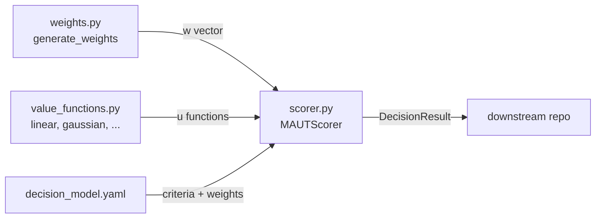
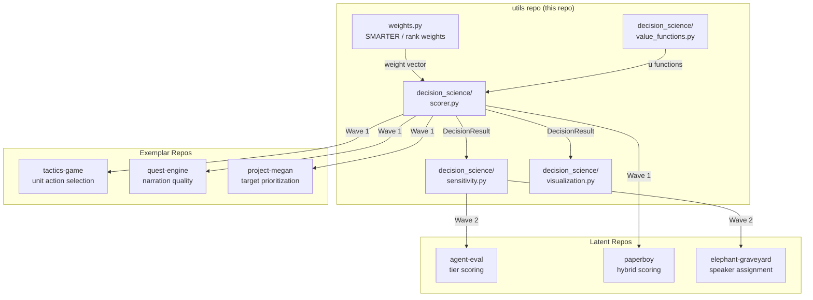
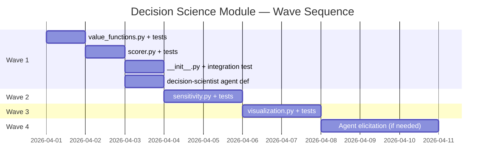

# CONOP: Decision Science Utility Module

**Status**: Proposed — awaiting code-reviewer challenge and lead decision
**Author**: proposer
**Date**: 2026-03-26
**Priority**: P1 — core professional domain of repo owner, upstream impact to 6+ repos

---

## Problem

Six downstream repos independently implement `U = Σ w×u` (Multi-Attribute Utility Theory) with no shared infrastructure. Each solved the same sub-problems — value function normalization, weight assignment, additive aggregation — in isolation. None have sensitivity analysis. None have visualization. None interoperate.

The Python MAUT/MCDA ecosystem has a specific gap that this repo is already positioned to fill: no library offers lightweight, config-driven utility theory with pluggable value functions and SMARTER weighting. `weights.py` is already ahead of the entire ecosystem on elicitation-free weighting. The logical extension is a scorer that consumes those weights and produces defensible decisions.

This CONOP defines four waves to build that infrastructure from the minimum viable core outward, with each wave delivering standalone value.

---

## Situation

### Friendly Forces (what we have)

- `weights.py` — SMARTER, rank-reciprocal, rank-sum; production-quality with tie handling
- `math_utils.py` — Combinatorics
- `geo.py` — Pure stdlib, zero dependencies, clean pattern to follow
- Agent infrastructure: proposer, code-reviewer, python-prototyper, test-runner
- Team template: `feature-development` (the right team for every wave here)

### Enemy Forces (what works against us)

- Six repos have inertia — they already have working code; migration must be low-friction
- Scope creep risk is high in decision science — every new method feels justified
- numpy is already a dependency (via weights.py/pandas); matplotlib would be new
- The domain spans a published academic literature; it is easy to over-engineer toward theory

### Terrain (ecosystem gaps we exploit)

- No Python library offers SMARTER weighting with additive MAUT scoring
- No library provides config-driven decision models (YAML schema for criteria + weights)
- No library has an agent-friendly I/O interface (structured JSON in, decision out)
- quest-engine already proved the value function pattern works in production

---

## Module Architecture

### Decision: Subpackage, not a flat module

The decision science surface area exceeds what fits cleanly in a single file. A subpackage at `src/myproject/decision_science/` provides:
- Clear import story: `from myproject.decision_science import MAUTScorer, linear`
- Logical separation between the scorer, value functions, sensitivity, and visualization
- `weights.py` stays in `utils/` — it is a standalone utility used by but not owned by decision science

```
src/myproject/
├── utils/
│   └── weights.py          (existing — no changes)
└── decision_science/
    ├── __init__.py          (re-exports the public API)
    ├── value_functions.py   (Wave 1)
    ├── scorer.py            (Wave 1)
    ├── sensitivity.py       (Wave 2)
    └── visualization.py     (Wave 3)
```

### Core Data Model

Everything flows through two simple structures:

```python
@dataclass
class Criterion:
    name: str
    weight: float               # normalized, sums to 1.0 across all criteria
    value_fn: Callable[[Any], float]  # maps raw score → [0, 1]

@dataclass
class DecisionResult:
    alternative: str
    utility: float              # U = Σ w×u, range [0, 1]
    breakdown: dict[str, float] # {criterion_name: weighted_utility}
```

No inheritance hierarchy. No abstract base classes. Two dataclasses and a scorer function. This is the simplest thing that works.

### Relationship to `weights.py`

`weights.py` produces weight vectors from ranks. `scorer.py` consumes weight vectors. They stay decoupled — `scorer.py` accepts `float` weights directly and does not import `weights.py`. A caller who wants SMARTER weights feeds `generate_weights()` output into `MAUTScorer`; a caller with direct weights skips it. This matches how all six repos currently work.



---

## Approaches Considered

### Approach A: Flat module in `utils/` (conservative)

Add `decision_science.py` alongside `weights.py`, `geo.py`, etc. Keep everything in one file.

**Pros**: Zero structural change; consistent with current pattern; easy to review.

**Cons**: Value functions + scorer + sensitivity + visualization in one file becomes 400+ lines fast. Forces artificial compression of the API. Value functions are conceptually distinct from the scorer — collapsing them hides intent.

**Risk**: Low initially, high after Wave 2 lands.

### Approach B: Subpackage `decision_science/` (recommended)

Separate subpackage from day one, even if Wave 1 is only two files.

**Pros**: Clean growth path. Each concern in its own file. Import story scales. The subpackage *signals intent* — this is a first-class module family, not a single helper.

**Cons**: Marginally more structure up front. Two files instead of one in Wave 1.

**Risk**: Low. Python subpackages are zero-ceremony with an `__init__.py`.

### Approach C: External library wrapper (rejected)

Wrap pymcdm or pyDecision as the computation backend.

**Pros**: Reduces implementation burden for ranking methods (TOPSIS, VIKOR, etc.).

**Cons**: pymcdm has no value functions. pyDecision is unmaintained. Neither has SMARTER. Neither is config-driven. The dependency cost exceeds the value. We would be wrapping the wrong layer.

**Verdict**: Do not take this path. The ecosystem gap is precisely where we add value.

**Recommendation**: Approach B. The subpackage cost is two lines of `__init__.py`. The organizational clarity it buys compounds across every wave.

---

## Wave Breakdown

### Wave 1 — Core MAUT Scorer + Value Functions

**Objective**: The minimum viable shared utility. A caller can define criteria with weights and value functions, pass in a set of alternatives with raw scores, and get back ranked `DecisionResult` objects.

**Scope**:
- `value_functions.py` — 7 functions: `linear`, `exponential`, `logarithmic`, `logistic` (S-curve), `step`, `gaussian`, `piecewise_linear`
- `scorer.py` — `MAUTScorer` class: `add_criterion()`, `score()`, `rank()`
- `decision_science/__init__.py` — re-exports public API
- `pyproject.toml` — no new required deps (numpy already present via weights.py/pandas)
- `tests/unit/test_value_functions.py`
- `tests/unit/test_scorer.py`

**TCS Items**:

| # | Task | Condition | Standard |
|---|------|-----------|----------|
| 1.1 | Implement 7 value functions in `value_functions.py` | All functions accept `(x, **params)` and return `float` in `[0, 1]` | Each function has unit tests covering boundary values (0, 1, midpoints) and edge cases (zero, negative, domain violations) |
| 1.2 | Implement `MAUTScorer` in `scorer.py` | Given N criteria and M alternatives, `rank()` returns `list[DecisionResult]` sorted descending by utility | Tests verify correct additive aggregation `U = Σ w×u`; weight normalization enforced; empty inputs raise `ValueError` |
| 1.3 | Expose clean public API via `__init__.py` | `from myproject.decision_science import MAUTScorer, linear, gaussian` works | Import test passes; no internal symbols leak into public namespace |
| 1.4 | All tests pass with no new required dependencies | `pytest tests/unit/test_value_functions.py tests/unit/test_scorer.py` runs green | Zero new entries in `[project.dependencies]` in `pyproject.toml`; numpy already present |

**Value function signatures** (all return `float` in `[0, 1]`):

```python
def linear(x: float, low: float = 0.0, high: float = 1.0) -> float: ...
def exponential(x: float, low: float, high: float, rate: float = 1.0) -> float: ...
def logarithmic(x: float, low: float, high: float) -> float: ...
def logistic(x: float, midpoint: float, steepness: float = 1.0) -> float: ...
def step(x: float, threshold: float, below: float = 0.0, above: float = 1.0) -> float: ...
def gaussian(x: float, center: float, sigma: float) -> float: ...
def piecewise_linear(x: float, breakpoints: list[tuple[float, float]]) -> float: ...
```

**MAUTScorer interface**:

```python
class MAUTScorer:
    def add_criterion(self, criterion: Criterion) -> None: ...
    def score(self, alternative: str, scores: dict[str, float]) -> DecisionResult: ...
    def rank(self, alternatives: dict[str, dict[str, float]]) -> list[DecisionResult]: ...
    def validate_weights(self) -> None: ...  # raises if weights don't sum to 1.0 ± tolerance
```

**Migration signal for exemplar repos**: tactics-game, quest-engine, project-megan can all replace their local aggregation loop with `MAUTScorer.rank()` in Wave 1.

---

### Wave 2 — Sensitivity Analysis

**Objective**: Allow callers to understand how robust a decision is. A decision that flips ranking under small weight perturbations is not the same as one that is stable across all plausible weight vectors.

**Scope**:
- `sensitivity.py` — three analysis methods
- `tests/unit/test_sensitivity.py`
- No new required dependencies; scipy is optional for Monte Carlo

**Analysis methods**:

| Method | What it does | When to use |
|--------|-------------|-------------|
| `one_at_a_time(scorer, alternatives, delta)` | Varies each weight ±delta, returns rank stability table | Quick first pass |
| `monte_carlo(scorer, alternatives, n_samples)` | Dirichlet samples over weight simplex, returns rank frequency matrix | Rigorous robustness check |
| `scenario_compare(scorer, alternatives, scenarios)` | Evaluates decision under named weight profiles (e.g., crawl/walk/run from agent-eval) | Stakeholder communication |

**TCS Items**:

| # | Task | Condition | Standard |
|---|------|-----------|----------|
| 2.1 | Implement `one_at_a_time()` | Given a scorer with N criteria and M alternatives, vary each weight by delta while renormalizing | Returns `dict[str, list[DecisionResult]]` keyed by criterion name; tests verify rank flips are detected |
| 2.2 | Implement `monte_carlo()` | Dirichlet-sampled weight vectors applied to scorer | Returns `dict[str, dict[str, float]]` rank frequency matrix; numpy-only (no scipy required) |
| 2.3 | Implement `scenario_compare()` | Named dict of weight profiles passed in | Returns `dict[str, list[DecisionResult]]` keyed by scenario name; matches agent-eval's crawl/walk/run pattern |
| 2.4 | All tests pass | `pytest tests/unit/test_sensitivity.py` green | No scipy in required deps; scipy is optional guard-imported |

**Note on Monte Carlo**: Dirichlet sampling via `numpy.random.dirichlet` requires only numpy, which is already present. scipy is not needed.

---

### Wave 3 — Visualization Helpers

**Objective**: Provide matplotlib-based output functions that cover the three most useful decision science charts. matplotlib is optional — Wave 3 works only when installed.

**Scope**:
- `visualization.py` — three plot functions
- `tests/unit/test_visualization.py` — tests using `matplotlib` mock or `pytest.importorskip`
- Optional dependency: `matplotlib` added to `[project.optional-dependencies]` under `[decision-science]`

**Plot functions**:

| Function | Output | Source repo pattern |
|----------|--------|---------------------|
| `radar_chart(results, criteria)` | Spider/radar comparing alternatives across criteria | tactics-game UI pattern |
| `tornado_plot(sensitivity_result)` | Horizontal bars showing weight sensitivity range | Standard OR visualization |
| `rank_stability_heatmap(monte_carlo_result)` | Heatmap of rank frequency by alternative × scenario | agent-eval tier comparison |

**TCS Items**:

| # | Task | Condition | Standard |
|---|------|-----------|----------|
| 3.1 | Implement `radar_chart()` | Given `list[DecisionResult]` and criteria names, produce matplotlib Figure | Returns `Figure` (caller controls display/save); tests use `pytest.importorskip("matplotlib")` |
| 3.2 | Implement `tornado_plot()` | Given OAT sensitivity result, produce horizontal bar chart | Returns `Figure`; readable with 3–10 criteria |
| 3.3 | Implement `rank_stability_heatmap()` | Given Monte Carlo frequency matrix, produce annotated heatmap | Returns `Figure`; uses `matplotlib` only, not seaborn |
| 3.4 | Optional dependency declared cleanly | `pip install -e ".[decision-science]"` installs matplotlib | `pyproject.toml` updated; module guard-imports matplotlib with helpful error on missing install |

---

### Wave 4 — Agent-Assisted Elicitation (Optional)

**Objective**: Enable LLM-assisted weight and value function elicitation. This is emerging research territory (DeLLMa, WALMAS, AHP+GPT-4). Build only if downstream repos demonstrate concrete need.

**Scope (if pursued)**:
- YAML decision model schema — define and validate a complete decision model in YAML
- Pairwise comparison elicitation via structured LLM prompts (AHP-style)
- JSON I/O schema for agent-friendly decision interfaces

**Gate condition**: Do not build Wave 4 until at least two downstream repos request it explicitly. The risk of premature agent-elicitation infrastructure is high — this is an active research area and correct design is unclear.

**What Wave 4 is NOT**:
- A full AHP solver (use pymcdm if you need that)
- A decision support system with user-facing UI
- A replacement for human judgment

---

## Design Decisions

### Naming: `decision_science/`

Not `maut/` (too narrow — sensitivity analysis and visualization are not MAUT-specific), not `mcda/` (implies ranking methods we're not building), not `utils/decision_science.py` (flat module doesn't scale). `decision_science/` is the honest name for the domain.

### Dependencies

| Dependency | Status | Rationale |
|-----------|--------|-----------|
| numpy | Already required (via pandas/weights.py) | Core numerics |
| pandas | Already required | `generate_weights()` returns DataFrame |
| matplotlib | Optional (`[decision-science]`) | Visualization only; not everyone needs plots |
| scipy | Not required | Dirichlet sampling via `numpy.random.dirichlet` is sufficient |
| pymcdm / pyDecision | Never | We fill the gap they leave; no value in wrapping them |

### Config-Driven Decision Models (Wave 1 extension)

A YAML schema for decision models is desirable but not Wave 1. The pattern would look like:

```yaml
# decision_model.yaml
criteria:
  - name: damage_output
    weight: 0.35
    value_fn: linear
    params: {low: 0, high: 100}
  - name: threat_proximity
    weight: 0.40
    value_fn: gaussian
    params: {center: 0, sigma: 50}
  - name: survival_probability
    weight: 0.25
    value_fn: logistic
    params: {midpoint: 0.5, steepness: 8}
```

A `from_yaml()` factory on `MAUTScorer` can be added in Wave 1 if the implementer judges it straightforward. It is not a Wave 1 gate condition.

### What We Do NOT Build

- TOPSIS, VIKOR, ELECTRE, PROMETHEE, or any outranking method — use pymcdm
- AHP pairwise matrix solver — use pymcdm
- Interactive decision support UI — out of scope for a utility library
- Uncertainty propagation over raw scores (fuzzy MAUT) — future Wave 4 extension

---

## Agent and Team Design

### New Agent: `decision-scientist`

**Recommendation**: Yes, add a `decision-scientist` Level 1 agent to `.claude/agents/`.

**Rationale**: The proposer and code-reviewer are domain-agnostic. A `decision-scientist` agent holds domain knowledge — it knows that weights must sum to 1.0, that value functions must be monotone (or explicitly non-monotone with justification), that sensitivity analysis is not optional for production decisions, and that SMARTER is appropriate for rank-ordered criteria but not for cardinal preference intensities. Without this agent, domain-specific errors slip through code review undetected.

**Scope**: Read-only (analysis and review). Write to `docs/` only (decision audit reports).

**When to use**:
- Reviewing decision model configurations in downstream repos
- Auditing weight assignments and value function choices
- Validating that sensitivity analysis was run before a decision is operationalized
- Catching domain violations (negative weights, value functions that don't span [0,1])

**Agent definition sketch**:

```
name: decision-scientist
description: Audits decision models for MAUT correctness, weight validity, and sensitivity coverage.
  Use when configuring criteria, reviewing decision model YAML, or before operationalizing a decision.
tools: Read, Write
model: inherit
```

**This is a Level 1 agent** — project-specific, not portable. It should be created when Wave 1 lands, updated as the module grows.

### New Team: `decision-science`

**Recommendation**: Add a `decision-science.md` team template.

**Composition**:

| Teammate | Role |
|----------|------|
| `proposer` | Problem framing, approach selection |
| `decision-scientist` | Domain review of model structure |
| `python-prototyper` | Implementation |
| `test-runner` | Validation |
| `code-reviewer` | Code quality gate |

**When to use**: Any wave of this CONOP; any downstream repo implementing or migrating a decision model.

**Relationship to `feature-development`**: `decision-science` is a specialization of `feature-development` that adds `decision-scientist` to the loop. For non-decision-science features, `feature-development` remains the default.

---

## Migration Path

### Exemplar Repos (direct MAUT)

**tactics-game** — Highest value target. Their `MAUTScorer` and `DoctrineProfile` map almost 1:1 to the proposed API. Migration path: replace their local scorer with `from myproject.decision_science import MAUTScorer`. Their GDScript layer stays domain-specific. Estimated effort: 1 session.

**quest-engine** — Their pluggable value functions (`linear`, `threshold_sigmoid`, `gaussian`, `binary_sigmoid`) are a subset of Wave 1's 7 functions. Migration: replace local functions with imports from `value_functions.py`. Their `evaluation.yaml` maps to the proposed YAML schema. Estimated effort: 1 session. **Also**: their missing attribute weight redistribution is a known gap — `MAUTScorer.validate_weights()` will catch it.

**project-megan** — Functionally MAUT but unlabeled. Their sensor fusion (smile, giggle, distance, novelty) maps to criteria. Migration: identify implicit weights, define them explicitly in a decision model, use `MAUTScorer`. This is an opportunity to formalize what was previously ad-hoc. Estimated effort: 1 session.

### Latent Repos (MCDA-adjacent)

**agent-eval** — Their crawl/walk/run tier profiles map directly to `scenario_compare()` in Wave 2. Wave 1 adoption is optional; Wave 2 is the high-value unlock. Migration: pass tier weight profiles as named scenarios.

**paperboy** — Their two-phase hybrid scoring (keyword + Claude semantic, configurable blend) is a 2-criterion MAUT problem in disguise. The blend weight is a criterion weight. Migration: model it explicitly as a decision, gain `MAUTScorer.validate_weights()` and sensitivity analysis.

**elephant-graveyard** — 7-signal evidence aggregation maps to 7 criteria. Confidence scoring maps to utility aggregation. Wave 1 gives them a standardized scorer; Wave 2 gives them Monte Carlo robustness checks on speaker assignment confidence. High-value adoption.

### What stays domain-specific

- Domain-specific value function parameters (e.g., tactics-game's damage scaling)
- Domain-specific criterion definitions and names
- Domain-specific raw score inputs
- Decision post-processing (e.g., tactics-game's action execution logic)

The rule: the decision model configuration is domain-specific; the scoring infrastructure is shared.

---

## Architecture Diagram



---

## Risks and Mitigations

| Risk | Likelihood | Impact | Mitigation |
|------|-----------|--------|-----------|
| Scope creep into ranking methods (TOPSIS etc.) | High | Medium | Explicit "what we don't build" section; code-reviewer enforces boundary |
| Wave 1 API is wrong for downstream use cases | Medium | High | Review against all 6 repos before implementation; don't generalize from one |
| matplotlib optional dep creates import confusion | Low | Low | Guard-import pattern with helpful error message; `pytest.importorskip` in tests |
| decision-scientist agent accumulates project-specific state | Medium | Low | Keep agent definition domain-focused, not repo-specific; review at each wave |
| Downstream repos resist migration (inertia) | Medium | Low | Wave 1 is additive — existing code is not broken; migration is opt-in |

---

## Open Questions

1. **`from_yaml()` in Wave 1?** The YAML config schema is useful and not hard to implement, but it adds scope. Should it be a Wave 1 gate item or a Wave 1 extension? Recommend: extension — implement if it fits within the session, but do not block Wave 1 on it.

2. **`Criterion` as a dataclass or namedtuple?** Dataclass allows defaults and optional fields. Namedtuple is immutable and lighter. Decision: dataclass — the `value_fn: Callable` field makes namedtuple awkward.

3. **Weight normalization — enforce or validate?** Two options: (a) auto-normalize weights to sum to 1.0, or (b) validate and raise if they don't. Auto-normalization hides errors; raise-on-invalid surfaces them. Recommendation: validate and raise with a clear message. The caller should own their weight budget.

4. **Does `decision-scientist` need write access to `src/`?** No — audit-only access is correct. Domain expertise should not be entangled with implementation authority.

5. **Propagation timing** — When Wave 1 ships, this becomes a doctrine propagation event. Which downstream repos get notified immediately vs. on their next session-start check?

---

## Execution Sequence



Wave 1 is a single feature-development team engagement. Waves 2 and 3 can each be done in a single session. Wave 4 requires a new proposer cycle before implementation.

---

## Recommendation

Build Wave 1 now. It is the highest-leverage change in the repo's history: it converts 6 independent wheel-reinventions into shared infrastructure, establishes a first-class decision science module that the ecosystem does not offer, and creates a platform for Waves 2–3.

Use the `feature-development` team template. Add the `decision-scientist` agent as part of Wave 1 deliverables so domain review is in place before Wave 2 adds complexity.

Do not build Wave 4 until there is explicit downstream demand.

**Bottom line**: A 3-file subpackage (`value_functions.py`, `scorer.py`, `__init__.py`) with 40–60 tests delivers more shared value than anything else in the backlog.
