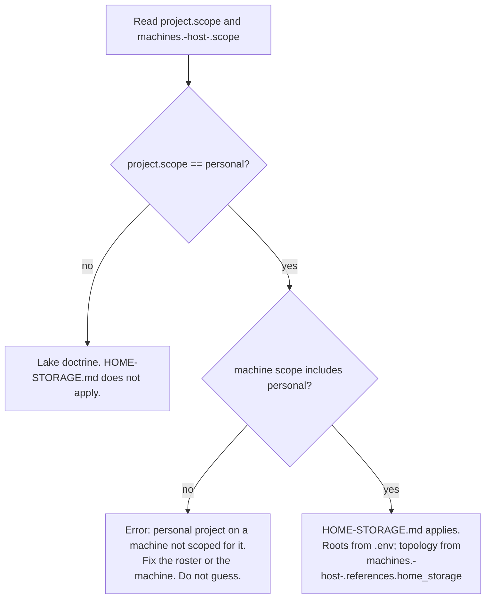

# Proposal: Home Storage Coverage for `lake-conventions`

**Author**: proposer
**Date**: 2026-08-30
**Type**: Proposal (skill / doctrine change)

**Sources read**: `docs/design/hold/STORAGE.md` (gitignored, real addresses, not quoted here);
`.claude/skills/lake-conventions/{SKILL.md,PREFLIGHT.md,ADOPTION.md}`;
`.claude/skills/writing-simple-and-direct/SKILL.md`; `config/project.yaml`;
`src/myproject/utils/machine.py`; `.env.example`; `.gitignore`.

---

## Problem

`.claude/skills/lake-conventions/` (version 1.0.0) documents conventions for one
destination: the work lakehouse. Bucket tiers, two path grammars, format-by-audience,
three client settings, and a dev/prod split, all scoped to an S3-backed object store.

`config/project.yaml` already carries a `machines:` roster with a per-machine
`scope: [work, personal]` list, so the fleet already knows some boxes do personal work.
Nothing in the skill or the roster says what a personal project should do when it writes
bulk data at home. `docs/design/hold/STORAGE.md` captures that doctrine for one real
deployment: a NAS reached by three address forms, a live-database hazard, a mirror job
that is not a backup, and a credentials rule. It is gitignored scratch and names real
hosts, shares, a pool, and local drive paths.

The job is to lift the generalizable rules out of STORAGE.md into the committed skill,
decide how an agent chooses lake doctrine versus home-storage doctrine, and make sure no
real address, credential, or path from STORAGE.md reaches git through the skill itself.

---

## Approaches Considered

### Approach A: New sidecar `HOME-STORAGE.md`, cited from SKILL.md

Add one file, `.claude/skills/lake-conventions/HOME-STORAGE.md`, holding the generalized
home-storage rules. SKILL.md gains a short routing paragraph near the top (which
destination applies, and why) plus one "When to use" bullet and a Version History entry.
The existing lakehouse body (buckets, path grammars, client settings, dev/prod) is
untouched.

This follows the pattern already in use twice in this repo: `lake-conventions` itself
loads `PREFLIGHT.md` and `ADOPTION.md` on demand, and `writing-simple-and-direct` loads
`RULES.md`, `EXAMPLES.md`, `REVIEWING.md`, `ADOPTION.md` the same way, explicitly "so a
reader loads only the file relevant to the task at hand."

- **Pros**: Matches an established pattern instead of inventing one. Keeps the lakehouse
  body lean; an agent doing NAS-only work never loads S3 signature-version tables, and an
  agent doing lake-only work never loads SMB hazards. Minimal diff to a file already
  propagated to nine downstream repos, which lowers re-propagation risk. Backward
  compatible: a repo that adopted 1.0.0 for lake work sees no behavior change.
- **Cons**: The skill's name, `lake-conventions`, describes only half its content once
  this lands. The frontmatter `description` (which Claude Code likely uses to judge
  relevance) has to grow a home-storage clause, so the change is not purely additive at
  the file-header level even though the body is.
- **Risk**: Low. New file plus small, additive edits to an existing one; nothing removed
  or renamed.

### Approach B (bold alternative): Split into a sibling skill, `home-storage-conventions`

Leave `lake-conventions` exactly as it is, forever scoped to the S3 lakehouse. Stand up a
new, independent skill directory with its own `SKILL.md` and `ADOPTION.md`, following the
same shape, for home storage.

- **Pros**: Names stay honest. A skill called `lake-conventions` only ever talks about the
  lake. A purely personal repo never has to skim Iceberg and Trino vocabulary to find its
  NAS rules, and a purely work repo never sees SMB and ZFS vocabulary. Adoption and
  rollback stay clean per skill; `ADOPTION.md`'s current rollback line, "Nothing else
  depends on them," stays true without having to carve a merged file back apart later. A
  repo can adopt one, both, or neither, matching the reality that lake access and home
  access are already independent capabilities in the roster.
- **Cons**: Doubles the ceremony (two `ADOPTION.md` walkthroughs, two version histories,
  two rollback stories) for what is, by line count, a short set of NAS rules. Nothing
  today unifies "which destination applies to my repo" the way one skill's routing
  section could; a mixed-scope repo has to know to load both skills separately. Diverges
  from the literal task framing, which asked to update `lake-conventions` to cover home
  storage, so choosing this needs a stronger reason than tidiness to override that
  instruction.
- **Risk**: Medium. Bigger surface for a first cut, and it contradicts the direct
  instruction given for this task, so it is presented to name the naming-drift cost
  honestly, not as a live contender for this cycle.

---

## Recommendation

**Approach A.** Add `HOME-STORAGE.md` as a sidecar and a short routing section in
`SKILL.md`. It is the smaller, lower-risk change, it reuses a pattern this repo already
trusts twice over, and it is what was asked for. Approach B's naming honesty is real but
premature: the skill has shipped one destination for one day (1.0.0 landed 2026-08-29,
per its own history). Renaming or splitting it before the home-storage half has been used
in anger would be optimizing a shape nobody has tested yet. Revisit the split once
`HOME-STORAGE.md` has a few real adoptions behind it; see Open Questions.

### What generalizes into doctrine

Every rule below is stated with no real host, share, pool, or drive path. STORAGE.md's
own examples are the source; only the pattern is kept.

| STORAGE.md rule | Generalized doctrine for `HOME-STORAGE.md` |
|---|---|
| Three address forms | A personal storage device answers to three forms: a server-side path (used only on the device itself: its own config, apps on the box, direct sessions), a client-side network path (UNC/SMB, used by every consumer machine: file managers, sync tools, application code), and an admin UI (humans configuring shares; no data flows through it). Client code never uses the server-side path. |
| Roots from environment | Scripts take data roots from named environment variables, never a hardcoded path. Missing configuration is a loud error, not a guessed default. (Full treatment below, this is the one STORAGE.md gets wrong for git.) |
| Live stores never over SMB | File locking over SMB/CIFS corrupts databases. Live stores stay local with the compute; only closed copies, or copies sourced from a snapshot, go to the device. |
| Mirror is not backup | A mirror sync that propagates deletions is not a backup. The device's own snapshot schedule, or a genuinely offline copy, is the undo. The mirror job is availability, not recovery. |
| Address by name | Reference the device by hostname, never by IP. A reservation makes an IP stable enough for today; names survive the device being replaced or the network being re-addressed. |
| Regular credentials | Client mounts authenticate as a least-privilege account. The admin account configures the device and never mounts client shares. Cache the credential through the OS credential store, not in a script. |
| Bulk data to the device | New bulk data belongs on the storage device. The workstation keeps working copies and does the processing, mirroring the lakehouse's own "new bulk data goes to the NAS" framing but for the personal side. |

### Scope selection, concretely

The task's own framing already states an AND-gate: "personal projects on machines whose
roster scope includes `personal`." That is two independent checks, not one:

1. **Project scope**: is this repo, itself, a personal project? This does not exist in
   `config/project.yaml` today; only `machines.<host>.scope` does. Add an optional
   `project.scope` field (`personal` or `work`, default `work` if absent, so every
   existing repo that has not opted in keeps its current lake-only behavior unchanged).
2. **Machine scope**: can this box even reach home storage? Already present:
   `machines.<host>.scope`, read today by `resolve_machine()` in
   `src/myproject/utils/machine.py`, which returns `Machine.scope: tuple[str, ...]`.

Project scope picks the doctrine; machine scope is a feasibility guard, not a router by
itself. A work project stays on lake doctrine even on a machine whose roster scope
includes `personal` (`titanx` today), because the project's nature, not the box's
capability, decides. A personal project on a machine whose scope does not include
`personal` is a misconfiguration, not a silent fallback: fail loudly, matching the
lakehouse's own "the safe default is refusing to guess."



**Where an agent looks for the real paths**, concretely, in three tiers:

1. **Doctrine** (rules, hazards, naming conventions): the committed skill,
   `HOME-STORAGE.md`. No addresses live here, ever.
2. **Runtime scalars** (a root path, a hostname if code needs it directly): `.env`,
   already gitignored project-wide (see `.gitignore`), exactly like `SLACK_BOT_TOKEN` and
   `DB_HOST` today. `.env.example` gains the variable *names* only, e.g. `HOME_MEDIA_ROOT=`,
   with no value, the same way it documents `DB_PASSWORD=your_password_here` without a
   real one.
3. **Topology narrative** (which shares exist, directory layout, snapshot schedule; the
   kind of prose STORAGE.md is) does not fit as an env var and should not live inside any
   one repo, gitignored or not, because home storage is a host-level fact, not a
   repo-level one, and a repo's own `.gitignore` is one more thing that has to be
   remembered correctly before it protects anything. Recommend it live outside every repo
   entirely, e.g. under the user's own config directory on that machine, and be pointed to
   from the roster the same way `references.lakehouse` already points at a whole separate
   repo: add `machines.<host>.references.home_storage: <path>` per personal-scoped
   machine. `machine.py`'s `Machine.references` is already `dict[str, Path]` built from
   whatever keys exist under `references:`, so this needs zero code change, only a new
   roster entry and, on each machine, the file it points to.

If a repo would rather keep that narrative doc inside its own tree (mirroring this hub's
`docs/design/hold/` pattern), that is acceptable, but `HOME-STORAGE.md` should say plainly
that the adopting repo's `.gitignore` must cover that path before the first real value is
written there. The hub's own gitignore covering `docs/design/hold/` is not inherited by
downstream repos automatically.

### The env-var example: what not to carry forward

STORAGE.md's code sample defaults an environment variable to a real network path:

```python
MEDIA_ROOT = Path(os.environ.get("MIMIR_MEDIA_ROOT", r"<real UNC path>"))
```

Two problems, independent of each other. First, the obvious one: a real address as an
inline default is exactly what the no-addresses-in-git rule forbids, even if only the
placeholder survives the copy into the skill. Second, and worth teaching regardless of
secrecy: defaulting to a guessed address is bad practice on its own terms. If the variable
is unset, the script does not fail fast, it reaches for a host that may not exist in this
adopter's environment, producing a slow DNS or SMB timeout instead of a clear message. That
is the same failure shape the lakehouse section already warns against in its own words: "A
bare invocation with no target is an error, not production." `HOME-STORAGE.md` should teach
the parallel rule instead:

```python
MEDIA_ROOT = Path(os.environ["HOME_MEDIA_ROOT"])  # KeyError names the missing var
```

or, for a friendlier message:

```python
try:
    MEDIA_ROOT = Path(os.environ["HOME_MEDIA_ROOT"])
except KeyError as exc:
    raise RuntimeError("Set HOME_MEDIA_ROOT in .env before running.") from exc
```

Also worth generalizing: STORAGE.md's variable name bakes in one project's codename
(`MIMIR_*`). The lakehouse section teaches namespace-generic variable names (`MINIO_*`,
`S3_*`) that mean the same thing in every adopting repo. `HOME-STORAGE.md` should teach a
placeholder convention, `<PROJECT>_<DATASET>_ROOT`, and let each adopter fill in its own
prefix, rather than presenting one deployment's naming as if it were universal.

### Companion files: lighter, and only for the well

The lakehouse's README.md + manifest.json contract exists for governed, multi-team,
Trino-queryable data: the manifest validates against an upstream JSON Schema and carries
fields (`lakehouse_path{bucket,prefix}`, `producer{script,version}`) that only make sense
for that backend. Home storage, per STORAGE.md, is two different shapes of data, and they
do not need the same treatment:

- **Bulk personal media** (a photo/video mirror of a local tree): no companion files.
  It is a straight mirror, self-describing by its own directory structure. A README.md per
  shoot or a manifest per folder is ceremony nobody will maintain.
- **The "well"** (source corpus, database replicas, agent artifacts fed to project work):
  a README.md beside each replicated or derived dataset earns its keep here, because a
  future agent or human needs to know what a store replica is a copy of, as of when, and
  whether it is safe to treat as current. Skip the JSON-Schema-validated manifest; there is
  no upstream schema for a personal NAS, and inventing one for a single deployment is
  speculative generality this project does not need yet.

So: the companion-file contract applies, but lighter, and only to the well, not to bulk
media, and without the machine-readable manifest half.

### Version bump

`lake-conventions` is 1.0.0 today, one day old. This change is purely additive: new
sidecar, new routing paragraph, new "When to use" bullet, new Version History entry;
nothing existing is removed or renamed. That is a minor bump, matching the semver-shaped
convention already visible in `writing-simple-and-direct` (1.0.0 to 1.0.1 for a
clarifying sentence; this change is bigger than that, a new capability domain, so minor
rather than patch).

Recommend **1.1.0**, with a history entry in the file's own voice:

> **1.1.0** (2026-08-30): Added home-storage coverage as a new sidecar, `HOME-STORAGE.md`,
> for personal projects on machines scoped for it. Harvested from a gitignored local
> storage doc, never committed; generalized by removing every hostname, share name, pool
> name, and local drive path, keeping the three-address-forms rule, environment-sourced
> roots, the live-database-over-SMB hazard, mirror-is-not-backup, address-by-name,
> regular-user-credentials, and bulk-data-to-device rules. `config/project.yaml` gains an
> optional `project.scope` field; routing between lake and home-storage doctrine reads it
> alongside the existing `machines.<host>.scope`.

---

## Open Questions

- **`project.scope` shape and default.** Single string (`personal` | `work`) versus a
  list like `machines.<host>.scope`. Recommend a single string, default `work`, since a
  project's nature is normally singular even when the machine it runs on serves several
  purposes. Needs a decision before `config/project.yaml` or `machine.py` changes; that
  change is python-prototyper's, test-first, not this proposal's.
- **Default location for the host-level topology doc.** `HOME-STORAGE.md` can teach "keep
  it outside every repo, point the roster at it" without mandating one exact path. Should
  ADOPTION.md still recommend a default (e.g., a dotfile under the user's home directory)
  so the fleet stays consistent across boxes, or is per-machine freedom fine here since
  nothing but that one machine ever reads it?
- **Preflight parity.** `PREFLIGHT.md` and `lake_preflight.py` check reachability,
  credentials-presence, and leg-threading for the lakehouse's multi-process pipeline.
  Nothing in this task asked for a home-storage equivalent, and STORAGE.md's flow (a
  scheduled mirror job, occasional corpus downloads) does not show the same
  multi-process threading hazard that justified the lakehouse preflight. Recommend
  deferring a home-storage preflight to a later cycle rather than building one now on
  spec.
- **Long-run naming.** Approach A keeps a skill named `lake-conventions` covering a
  second, unrelated backend. That is the right call for a one-day-old skill with no
  home-storage adoptions yet, but it is worth re-checking once `HOME-STORAGE.md` has a
  few real repos using it: does the name still fit, or has the case for Approach B's
  split gotten stronger with evidence instead of speculation?
- **The "well" layout.** STORAGE.md's `corpus/`, `stores/`, `artifacts/` layout is
  explicitly marked "suggested" in its own source. Recommend `HOME-STORAGE.md` keep it as
  an example shape, not a mandate, consistent with how the lakehouse section presents its
  own path grammars as a choice ("pick by what the data is, not by preference") rather
  than a single fixed tree.

---

## Summary

Add `HOME-STORAGE.md` as a new sidecar to `lake-conventions`, with a short routing
paragraph in `SKILL.md` that sends personal-scoped projects on personal-scoped machines to
it and leaves the existing lakehouse doctrine untouched; carry over the three-address-forms
rule, environment-sourced roots, the live-database-over-SMB hazard, mirror-is-not-backup,
address-by-name, regular-user-credentials, and bulk-data-to-device rules in fully
generalized form, with no real hostname, path, or share reaching git; teach a fail-loud
environment-variable pattern instead of STORAGE.md's guessed-default one, and a
generic `<PROJECT>_<DATASET>_ROOT` naming convention instead of one deployment's codename;
route real values through `.env` for scalars and a new, machine-roster-referenced,
out-of-repo topology doc for everything else; apply the companion-file contract only to
the well's derived datasets, README-only, skipping the lakehouse's JSON-Schema manifest;
and bump the skill to 1.1.0.
