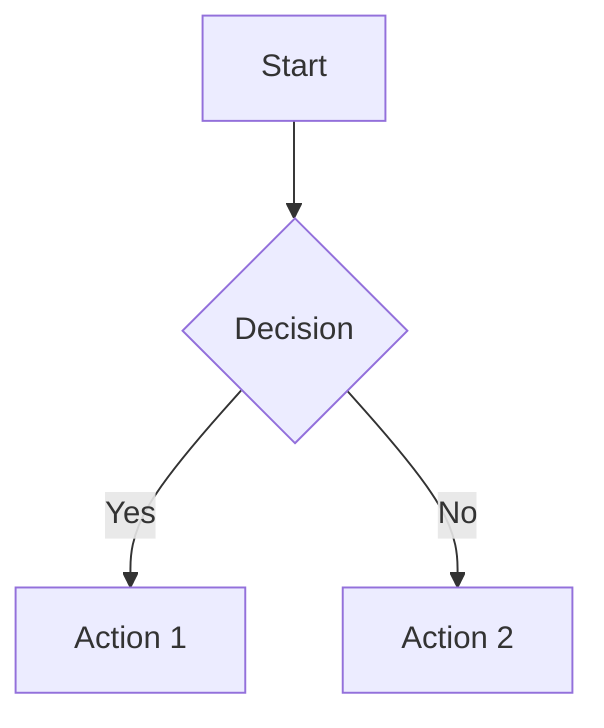
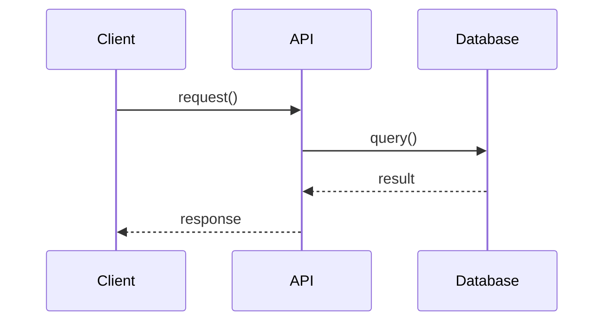
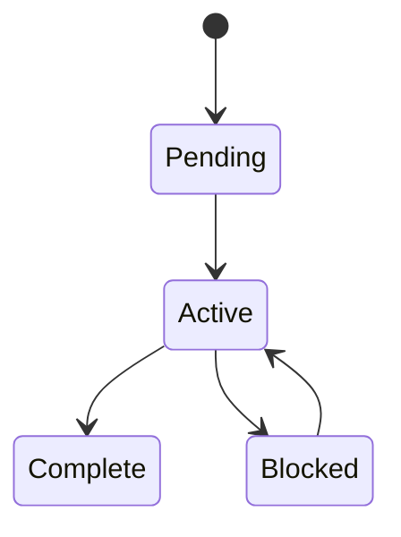
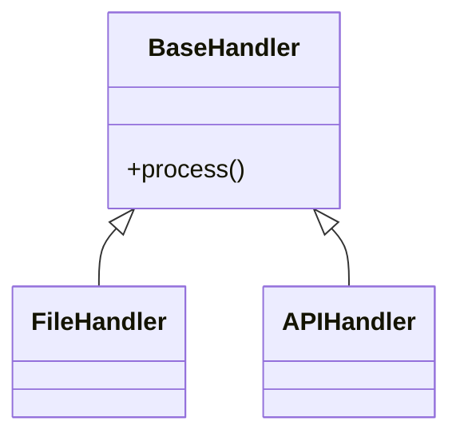

# Session Doc Format

Reference for the `docs/sessions/YYYYMMDD_<subject>.md` format produced by `/session-end`. Demoted from `.claude/skills/session-end.md` on 2026-05-19 — the workflow stays at `.claude/commands/session-end.md`, this file holds the format details.

For the broader Git workflow conventions (branch strategy, commit message tags, pre-commit checks), see `.claude/commands/session-end.md` directly.

---

## File Naming

- **Format**: `docs/sessions/YYYYMMDD_descriptive_filename.md`
- **Example**: `docs/sessions/20260519_doctrine_artifact_buildout.md`
- Underscores between words; lowercase; describe the subject, not the activity.

---

## Knowledge Graph Header

Session docs create edges to permanent documents — design docs, plans, prior sessions, external references. The header is the graph.

### Header Template

```markdown
# Session: Descriptive Title

**Date**: YYYY-MM-DD
**Branch**: main
**Tags**: #session #domain #activity

**Documents**: [pillars.md](../design/pillars.md) — Design principles this session touched
**Implements**: [plan.md](../plans/plan_name.md) — Plan being followed (if any)
**References**: [other.md](../background/other.md) — Docs consulted during work
**Follows**: [prev_session.md](20260220_prev.md) — Previous session (if continuing)
**Completes**: Phase N — Name (from project.yaml)
**Requires**: [blocker.md](../design/blocker.md) — Unresolved dependency (if any)
**Cites**: [source.md](../background/source.md) — External reference or algorithm source

---
```

Only include the relationship fields that actually apply. Do not pad with empty links.

### Relationship Types

| Relationship | When to Use |
|---|---|
| `**Documents**:` | Link to system/design docs this session touched (most common) |
| `**Implements**:` | If following an implementation plan |
| `**References**:` | Other docs consulted during work |
| `**Follows**:` | If continuing a previous session |
| `**Completes**:` | Phase or milestone this session finishes |
| `**Requires**:` | Unresolved dependency blocking future work |
| `**Cites**:` | External reference, algorithm source, or prior art |

---

## Tag Taxonomy (Canonical)

| Category | Tags | Use for |
|---|---|---|
| **Type** | `#session` | Always include for session logs |
| **Domain** | `#util` `#config` `#cli` `#infra` `#agents` `#doctrine` | What area of the project |
| **Activity** | `#feature` `#bugfix` `#refactor` `#docs` `#setup` | Type of work |
| **Status** | `#complete` `#in-progress` | Work completion state |
| **Pillars** | `#pillar-1` through `#pillar-N` | Design principle relevance |

Search examples:
```bash
grep -r "#doctrine" docs/sessions/                  # All doctrine work
grep -r "Documents.*pillars" docs/sessions/         # Sessions that touched pillars
grep -r "Follows.*20260421" docs/sessions/          # Sessions continuing 2026-04-21
```

---

## Session Body Structure

```markdown
## Summary

[Brief overview of work completed in this session — 2-4 sentences.]

## Work Completed

[Organized by sub-topic or wave. Each sub-topic gets a heading.]

### 1. <Sub-topic>

[What was done, why, what files changed.]

### 2. <Sub-topic>

[As above.]

## Key Decisions

| Decision | Rationale |
|---|---|
| <Decision A> | <Why> |

(Optional. Include only if non-obvious decisions were made.)

## Pillar Compliance

| Pillar | Status | Notes |
|---|---|---|
| **Simplicity First** | PASS | <Why> |
| **Shift-Left Testing** | PASS | <Why> |
| **Config-Driven** | PASS | <Why> |

(Optional. Use when changes touch areas governed by pillars.)

## Commits

| Hash | Subject |
|---|---|
| `abc1234` | [area] Commit subject |

## Next Steps

- [ ] Outstanding tasks
- [ ] Future improvements
- [ ] Known issues to address
```

---

## Diagram Guidelines

### When to Use ASCII

- Simple linear flows
- Component relationships at a glance
- Directory structures
- Basic state transitions

### When to Use Mermaid

- Complex decision trees
- Multi-step workflows with conditionals
- State machines
- Class diagrams or entity relationships
- Sequence diagrams

### Mermaid Quick Reference

**Flowcharts** (workflows, decision trees):


**Sequence Diagrams** (API interactions, data flows):


**State Diagrams** (status flows):


**Class Diagrams** (data models, type hierarchy):


Per the project's CLAUDE.md documentation style: **prefer Mermaid over ASCII art** in markdown documentation. Mermaid renders natively in GitHub and is easier to maintain.

---

## Best Practices

- **Include date, branch, and tags** in every session doc — the knowledge graph depends on them.
- **Validate that relationship edges point to real files** before committing.
- **Only include relationship fields that apply** — don't pad with placeholder links.
- **Use the right diagram type** for the complexity at hand.
- **Always include Summary and Next Steps** — the rest is optional.
- **Tag with activity and status** so sessions can be filtered by type.

---

**Source**: Demoted from `.claude/skills/session-end.md` on 2026-05-19 (skill deduplication; workflow remains in `.claude/commands/session-end.md`).
