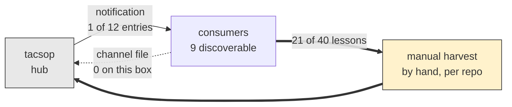

# Session: Fleet Poll and Loop-Closure Audit, from the Machine the Hub Cannot See

**Date**: 2026-08-28
**Branch**: main
**Tags**: #session #doctrine #whetstone #propagation #infra #complete

**Documents**: [docs/tasks.md](../tasks.md), [docs/propagation-protocol.md](../propagation-protocol.md), [config/project.yaml](../../config/project.yaml), [.claude/commands/pcc.md](../../.claude/commands/pcc.md)
**Implements**: [conop_whetstone_recursive_doctrine_loop.md](../plans/conop_whetstone_recursive_doctrine_loop.md) (Wave 1 window, session count contested; A2 extended to a third and fourth foreign corpus; D10 third instance; the session-count collision recorded as Wave 1 evidence)
**References**: [20260828_cross_repo_feedback_loop_check.md](20260828_cross_repo_feedback_loop_check.md), [20260827_stx_server_lessons_harvest.md](../reviews/20260827_stx_server_lessons_harvest.md), [docs/doctrine-updates.md](../doctrine-updates.md) (2026-08-21 and 2026-08-27 entries), [traversing-the-knowledge-base/SKILL.md](../../.claude/skills/traversing-the-knowledge-base/SKILL.md), [docs/session-doc-format.md](../session-doc-format.md); `ffskg` `CLAUDE.md` lines 240-248 and commit `6f4929a`; `contract-knowledge-graph` commit `c623c1f`; `aar_ai_pipeline` commits `5ed3cdd` and `8af80f4`
**Follows**: [20260828_cross_repo_feedback_loop_check.md](20260828_cross_repo_feedback_loop_check.md)

---

## Summary

Two machines had been running WHETSTONE Wave 1 in parallel without knowing it. This box held the 2026-08-21 and 08-22 work uncommitted while the other box committed 08-27 and 08-28 and pushed; both numbered their own sessions 1 and 2 of the same five-session window. Merging the two took three conflict resolutions and produced the session's first finding: the loop's own metric does not survive parallel work.

The session then polled all 13 git repositories on this box against the traversal skill and the propagation loop, to answer whether the structure can become quasi-recursive and self-learning. It can, and twice it already has. The limits are mechanical rather than conceptual, and this box can see two of them the other box cannot: the fleet is partitioned across machines with each half invisible to the other, and the notification script ships one doctrine entry out of twelve, a defect a downstream repo diagnosed on 2026-08-13 and never sent home.

One correction to a number stated mid-session. Forty `LESSON (OBSERVED)` lines exist and all forty sit in this repo, which reads as though nothing has come upstream. Twenty-one of them carry `origin: stx-server`. The upward direction has produced real volume; what it has not produced is a channel, because that volume arrived by a person walking into the repo and harvesting by hand.

| Metric | Value |
|---|---|
| Git repositories on this box | 13 |
| Discoverable by `propagate_doctrine.py` | 9 |
| Carrying `traversing-the-knowledge-base` | 4 |
| Distinct copies of that skill among the 4 | 3 |
| Doctrine entries in the hub | 12 |
| Doctrine entries the notification carries | 1 |
| Consumers with zero mentions in the hub corpus | 5 of 13 |
| Repos the hub discusses that are not on this box | 3 |
| `LESSON (OBSERVED)` lines, hub corpus | 40 |
| Of those, `origin: stx-server` | 21 |
| `.claude/upstream-lesson.md` files on this box | 0 |
| Adoption to first organic use, where it happened | 1 day |
| Check 5, this session | 0 MISSING over 21 paths; 0 MISSING-DIR |
| Tests | 240 passed, 5 skipped |
| Em dashes added to running prose | 0 |

## Work Completed

### 1. The merge, and what it exposed

`KB-graph: blast radius on the four overlapping files before merging → docs/doctrine-updates.md, docs/tasks.md, docs/propagation-protocol.md, and the WHETSTONE CONOP; git merge-tree confirmed the commits themselves do not conflict, so only the working tree blocked`

Local `main` sat 4 commits behind `origin/main` with 7 modified files, 4 of them overlapping the incoming set. The two bodies of work turned out to be disjoint rather than duplicated: origin's `docs/doctrine-updates.md` had the 2026-08-27 Figure Style entry and no 2026-08-21 entry at all, and origin's `docs/tasks.md` had zero mentions of `aar_ai_pipeline` against eight here.

Two conflicts resolved mechanically by keeping both sides in the right order. `docs/doctrine-updates.md` is reverse-chronological, so 08-27 sits above 08-21. The CONOP Status Log is chronological ascending, so 08-15 sits above 08-21 and 08-22.

The third conflict needed a judgment call and did not get one. Both machines had written "session 1 of 5" and "session 2 of 5" into the same task line for different sessions. The union is four dated window sessions with two numbering schemes, plus 2026-08-15 (A6 canary seeding), which neither machine counted and neither ruled out. The window is therefore somewhere between 4 and 6 of 5 and the Wave 1 exit criterion cannot be evaluated. The task line now carries the union with numbering marked unresolved, and a new P1 tracks settling it.

Two structural facts fall out, both recorded in the CONOP Status Log:

- **The window counter lives in a mutable task line, which is a single-writer structure that two machines wrote.** M3's non-author verification assumes one ordered record. There were two.
- **The 08-21 and 08-22 sessions produced no session doc,** recording their M1 evidence in the Status Log instead. M1 as specified greps `docs/sessions/`, so the metric scores at zero the two sessions that did the most traversal work in the window.

Commits, split per check 6's gate-separation rule:

| Hash | Subject |
|---|---|
| `8cef47d` | `[gate]` Check 5: name three blind spots, add a directory pass |
| `0345704` | `[doctrine]` 2026-08-21 traversal entry; two foreign-corpus runs; D10 harvest |
| `1f1a795` | Merge origin/main: two machines' Wave 1 work, and a session-count collision |

### 2. The fleet poll

`KB-graph: forward search for .git across ~/projects at depth 6 → 13 repos, four more than a depth-4 pass finds; then per-repo forward search for .claude/, its subdirectories, the traversal skill, and KB-graph: lines`

Thirteen repositories. Nine carry `.claude/commands/` and are therefore discoverable by `propagate_doctrine.py`. Four carry the traversal skill.

| Repo | `.claude/` | Traversal skill | Adopted | First organic use | Organic `KB-graph:` lines |
|---|---|---|---|---|---|
| `tacsop` (hub) | yes | yes | 2026-08-14 | 2026-08-27 | 2 session docs |
| `contract-knowledge-graph` | yes | yes | 2026-08-22 (`c623c1f`) | 2026-08-22 | 4 across 3 session docs |
| `aar_ai_pipeline` | yes | yes | 2026-08-22 (`5ed3cdd`) | 2026-08-23 | 3 across 3 session docs |
| `ffskg` | yes | yes | 2026-08-27 (`6f4929a`) | none | 0 |
| `paperboy` | yes | no | — | — | 0 |
| `velocity-scoring` | yes | no | — | — | 0 |
| `server_monitor` | yes | no | — | — | 0 |
| `tide` | yes | no | — | — | 0 |
| `drought-plan-scoring` | yes | no | — | — | 0 |
| `launch-control` | yes | no | — | — | 0 |
| `cccpo-app` | no | no | — | — | 0 |
| `dis-lakehouse` | no | no | — | — | 0 |
| `knowledge-base` | no | no | — | — | 0 |

**Where the skill ships, it gets used within a day, unprompted.** `contract-knowledge-graph` adopted it on 08-22 and traversed organically in the same day's session 113 and again in session 114 on 08-24. `aar_ai_pipeline` adopted it on 08-22 and traversed on 08-23 in two separate sessions. The uses are in modes the skill names and not decoration: blast radius on `.env` before editing it, which found that `.env.example` already carried the key; a provenance chase from a staging manifest back to its producers; blast radius on `hindsight_training.yaml`, which found the corpus contract. This is the strongest positive signal in the data, and it comes from two repos with different owners and different domains.

**`ffskg` is the counter-case and the more interesting one.** It adopted the skill on 2026-08-27 and has not used it. It also adopted it without any hand-delivery recorded in the hub, and the hub's corpus does not mention the repo at all.

**Correction to a standing P2.** The roster task records filesystem discovery finding 4 consumers on this box. It now finds 9. `aar_ai_pipeline`, `ffskg`, `server_monitor`, `tide`, and `velocity-scoring` all came into range since that count was taken. The roster in `docs/propagation-protocol.md` still lists 19.

### 3. Skill drift across the four copies

Three distinct files among four copies, one week after the skill shipped.

| Repo | Lines | md5 (first 8) | Changed lines vs hub |
|---|---|---|---|
| `tacsop` | 80 | `7540c382` | — |
| `contract-knowledge-graph` | 81 | `153b6384` | 33 |
| `ffskg` | 81 | `153b6384` | 33 |
| `aar_ai_pipeline` | 84 | `e9e3c8c7` | 56 |

Most of this is intended. `ffskg`'s adoption commit says so explicitly: "six hub-specific values recounted for this repo," and it records a local measurement the hub never made, that path mentions outnumber markdown links 10:1 in that corpus, so a link-only traversal misses roughly nine tenths of the graph. That is the skill working as designed and a downstream repo producing a number worth having.

The problem is that nothing distinguishes intended customization from rot. The hub's copy now carries a three-blind-spot list the other three do not, and there is no mechanism by which they would learn of it short of the next full cycle.

### 4. The loop, audited link by link

**Downward, the transport ships one entry.** `propagate_doctrine.py --dry-run` names 9 targets and emits exactly 1 of the hub's 12 doctrine entries, the most recent. Six of the nine discoverable consumers have never received the 2026-08-21 traversal entry, and running the script today would not give it to them; they would receive the 08-27 Figure Style entry alone, which cites a skill they do not have.

`ffskg` found this on 2026-08-13, during its first doctrine cycle, and wrote a standing workaround into its own `CLAUDE.md`:

> Check the hub's `docs/doctrine-updates.md` directly: that notification file has under-reported the outstanding set in every cycle observed so far.

Fifteen days. Never came upstream. This is the third confirmed D10 instance after `launch-control`'s audit-hook glob (May 2026, 3 months) and `aar_ai_pipeline`'s unversioned `.claude/` (structural). It differs from both in kind: it is a defect in the loop's own transport, found by a consumer, and the consumer's fix was to route around the hub rather than to tell it.

**Upward, the channel exists on two repos and neither is on this machine.** Zero `.claude/upstream-lesson.md` files here. The A6 canaries are `tactics-game` and `veil-engine`, both on the other box, so this session could neither confirm nor falsify the 2026-08-28 A6 read.

**Upward, the harvest works and has produced real volume.** Forty `LESSON (OBSERVED)` lines in the hub corpus: 36 fleet-scope, 4 repo-scope; 21 UPDATE, 14 ADD, 4 NOOP, 1 ADD-ON-NEXT-CYCLE. Twenty-one carry `origin: stx-server`, harvested on 2026-08-27 from a repo that was 36 hours old. The headline export of that harvest was a whole Level 0 skill, `designing-clear-data-displays`, which the hub adopted intact.

This is the correction to the number stated earlier in the session. All forty lines sit in this repo, which is true and misleading. Slightly more than half of them originated downstream. The upward direction is not empty; it is unautomated. Every closure so far ran through a person or agent walking into another repository and reading it.

**The capture point was never shipped.** `.claude/commands/session-end.md` and `docs/session-doc-format.md` ask for neither a `KB-graph:` line nor the Step 5.5 upward-lesson channel that the two canaries got. The hub's own M1 record is author discipline, not a default, and the same is true in `stx-server`, whose reviewer diagnosed exactly this on 2026-08-27. A convention that is documented in a skill but not requested at session close depends on whoever is holding the keyboard remembering it.

### 5. The recursion question, answered

Two closures are on the record, and both are genuine.

The first ran the hard direction. On 2026-08-27 a consumer built a Level 0 skill and the hub adopted it whole. Doctrine flowed upward and the hub changed because of it.

The second was self-referential. On 2026-08-28 a downstream review measured the hub's own traversal instrument, found M1 failing at 2 of 5, and named the cause. A consumer audited the mechanism by which the hub learns and prescribed the fix.

So the answer is yes, with three qualifications, all mechanical:

1. **The observer is per-machine.** The hub's corpus discusses `stx-server` (8 files), `veil-engine` (11), and `tactics-game` (13); none is on this box. This box holds `ffskg`, `server_monitor`, `tide`, `cccpo-app`, and `dis-lakehouse`; the hub mentions none of them. `ffskg` adopted the flagship skill of the current cycle and the hub does not know the repo exists. Today's session-count collision is the same break surfacing in the metrics. A loop cannot converge on a state that no single participant can observe.
2. **The transport is lossy in a way that is invisible from the hub.** One entry of twelve, with no acknowledgment, so a consumer that misses a cycle stays missed and the hub reads the same either way. This is the A5 pattern again at fleet scale: an instrument that cannot fire looks exactly like an instrument reporting clean.
3. **The capture point is a convention rather than a default.** Both directions depend on someone remembering to write a line that nothing asks for.

None of the three requires new theory. The first is a ledger problem, the second is roughly a loop over entries rather than a head, and the third is two edits to files that already exist.

## Key Decisions

| Decision | Rationale |
|---|---|
| Keep both sides of all three merge conflicts | The two machines' work is disjoint, not duplicated. Discarding either would have lost a real cycle. |
| Leave the Wave 1 session numbering unresolved and file a P1 | Picking a number would fabricate a window boundary the CONOP's exit criterion depends on. The count is the user's call and the CONOP does not define "qualifying" beyond session 0. |
| Split the gate change into its own commit | Check 6, D4. The check-5 edit is a gate surface and the doctrine entry is work that gate judges. |
| Record the poll's findings without fixing them | The user asked for documentation this session. Each of the three breaks changes a shipped artifact and belongs to its own gate evaluation. |
| Do not push | Three commits ahead including a merge that reconciles another machine's work. The user's call. |
| Correct the lesson-origin number in the record | The mid-session claim was location-accurate and implied the upward channel had produced nothing. Twenty-one of forty came from downstream. |

## Pillar Compliance

| Pillar | Status | Notes |
|---|---|---|
| **Simplicity First** | PASS | No code written. Three merge resolutions, one appended Status Log entry, one new task, one corrected task line. |
| **Shift-Left Testing** | N/A | Doc-only session. Suite run before and after the merge: 240 passed, 5 skipped. |
| **Config-Driven** | PASS | `config/project.yaml` state block updated to match what is true. |

## Wave 1 Metrics, This Session

- **M1**: this session doc carries 3 `KB-graph:` lines. The 08-21 and 08-22 sessions carry none because they wrote no session doc, which is itself recorded above as a metric defect.
- **M2**: check 5 clean on both passes, 0 MISSING over 21 paths and 0 MISSING-DIR, run before the merge and again after.
- **M3 candidates**: the pre-merge blast-radius traversal named the four overlapping files and all four were then edited; the depth-6 forward search named `ffskg`, which the poll then made the session's central finding. Non-author verification still required at window close.
- **A2 extended**: the routing recipes ran against two further foreign corpora (`ffskg`, and nine repos at directory level). The instrument transferred again and produced the `ffskg` blind spot on first contact.
- **Fourth instance of the same defect class, this time self-inflicted at session close.** The ad-hoc one-liner written to verify this doc's own header edges reported all ten as BROKEN. Every one resolves; `tr -d '](' ` strips the brackets and leaves the closing paren, so each candidate path carried a trailing `)`. Same shape as the `sed`-range failures in `contract-knowledge-graph` and `aar_ai_pipeline`: a throwaway gate one-liner, no error raised, a confident wrong answer. It differs in the direction of the error, which is what made it survivable. This one shouted where those two stayed silent, and a false positive gets investigated in seconds while a false negative gets believed for three months. `LESSON (OBSERVED): a gate one-liner fails silently by default and loudly by luck; when writing one, prefer the formulation whose failure mode is a false positive, and never trust a first clean run from a one-liner written in the same session as the thing it checks | evidence: this session's edge check, 10 of 10 false BROKEN; the two sed-range failures for the silent case | scope: fleet | owner: .claude/commands/pcc.md check 5 | verdict: ADD-ON-NEXT-CYCLE`.

## Commits

| Hash | Subject |
|---|---|
| `8cef47d` | `[gate]` Check 5: name three blind spots, add a directory pass |
| `0345704` | `[doctrine]` 2026-08-21 traversal entry; two foreign-corpus runs; D10 harvest |
| `1f1a795` | Merge origin/main: two machines' Wave 1 work, and a session-count collision |
| (this commit) | `[doc]` Fleet poll and loop-closure audit; session record, tasks, state |

## Next Steps

- [ ] Push. Three commits ahead of `origin/main`, one of them a merge reconciling the other machine's Wave 1 work. Until it lands, the two boxes diverge again.
- [ ] Settle the Wave 1 session count (new P1). The exit criterion cannot be evaluated without it.
- [ ] Ship the capture point: a `KB-graph:` line in `session-end.md` Step 5, and Step 5.5 in the hub's own `session-end.md`. Two edits, and they turn both metrics from discipline into defaults.
- [ ] Make the notification carry the unacknowledged set rather than the newest entry. `ffskg` wrote the spec in prose fifteen days ago.
- [ ] Move the fleet ledger off per-machine discovery, or accept that the fleet has no single observer and say so in the protocol.
- [ ] Set a git identity. This box has none in the repo, in `~/.gitconfig`, or in the environment; all three commits used `jhutchison0 <jhutchison@anl.gov>` passed explicitly, read off the existing history.
- [ ] Fold `ffskg`, `server_monitor`, `tide`, and `velocity-scoring` into the roster task. Discovery finds 9 now, not 4.

---

*Session closed 2026-08-28. The hub asked whether it could learn from its consumers, and found a consumer that had been correcting it in writing for fifteen days.*
