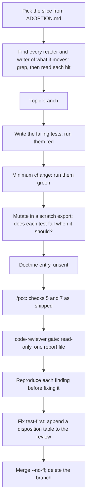

# Session: The Common Operating Picture at the Hub: Gap Register, State Block, and the Assay Exclusion

**Date**: 2026-10-04
**Branch**: main; topic branches `topic/cop-gap-register` (merged `c4905de`), `topic/cop-slice2-state-block` (merged `3612a42`), `topic/propagation-exclude-assay` (merged `8e73508`), each deleted at merge
**Tags**: #session #doctrine #infra #config #feature #complete
**Documents**: [docs/gaps.md](../gaps.md), [config/project.yaml](../../config/project.yaml), [docs/tasks.md](../tasks.md), [session-start.md](../../.claude/commands/session-start.md), [session-end.md](../../.claude/commands/session-end.md), [sitrep.md](../../.claude/commands/sitrep.md), [pcc.md](../../.claude/commands/pcc.md), [CONTEXT.md](../../CONTEXT.md), [LANGUAGE.md](../../LANGUAGE.md), [propagation-protocol.md](../propagation-protocol.md), [propagate_doctrine.py](../../scripts/propagate_doctrine.py), [doctrine-updates.md](../doctrine-updates.md)
**Implements**: [ADOPTION.md](../../.claude/skills/maintaining-the-common-operating-picture/ADOPTION.md) (the first and second slices); the 2026-10-02 P1 that kept propagation out of the `assay` mirror
**References**: [20261004_cop_gap_register_gate.md](../reviews/20261004_cop_gap_register_gate.md), [20261004_cop_slice2_gate.md](../reviews/20261004_cop_slice2_gate.md), [20261004_propagation_exclude_gate.md](../reviews/20261004_propagation_exclude_gate.md), [maintaining-the-common-operating-picture/SKILL.md](../../.claude/skills/maintaining-the-common-operating-picture/SKILL.md), [maintaining-project-context/SKILL.md](../../.claude/skills/maintaining-project-context/SKILL.md), [traversing-the-knowledge-base/SKILL.md](../../.claude/skills/traversing-the-knowledge-base/SKILL.md)
**Follows**: [20261002_backlog_cycle_private_terms_and_release_drafts.md](20261002_backlog_cycle_private_terms_and_release_drafts.md)

---

## Summary

The hub adopted the first two slices of its common operating picture and put a write guard on doctrine propagation. The aim is that an agent reading this repo finds no sentence of state that has stopped being true, because there are none left to find. A measured fact (the suite, the branch, the tools) is measured by command at `/session-start`. The campaign's order is intent, at the head of `docs/tasks.md`. What nobody can see is in `docs/gaps.md`. History stays in records.

The driver, in the user's words: two days of programming in another repo went to agents that "read old/incorrect status rather than running calculations, assessments, live." The skill `maintaining-the-common-operating-picture` was written for that failure and merged earlier today (`fcc094e`, `4e4c28a`), drafted in `assay`; it had no session record, and this doc is it.

Three pieces landed, each on its own topic branch, test-first, through a `code-reviewer` gate whose every Warning was applied before merge:

1. **Slice 1, the gap register.** `docs/gaps.md`, checked by `src/myproject/utils/gaps.py` and pinned by `tests/unit/test_gaps.py`. `known_issues` left the config; five of its eight entries were gaps.
2. **Slice 2, the state block leaves.** `config/project.yaml` is identity only. The focus moved to a `## Focus` section; `/session-start` tags every summary line with where it came from; `CONTEXT.md` names where state lives instead of keeping a snapshot; orientation files keep no count that drifts.
3. **The `assay` exclusion.** `propagation.exclude` in the config lists repos the hub never writes into; the script skips them by name and fails closed on a malformed list.

A traversal before the push found five living references the slices had missed, and fixed them. Nothing propagated. Two doctrine entries are unsent: the skill's and slice 2's. The plan is in the Focus: `assay` adopts in its own session on 2026-10-05, the hub reads what it learns and revises the entries, then one cycle from Nidhogg.

| Metric | Value |
|---|---|
| Tests on `main`, start of session (`4e4c28a`) | 462 passed |
| Tests on `main`, end of session (`8e73508`) | 540 passed (`test_gaps.py` 29, `test_state_block.py` 34, `test_pcc_reference_integrity.py` 3, 12 more in `test_propagate_doctrine.py`) |
| Commits since `4e4c28a`, before this doc | 19 (3 merges) |
| Files changed since `4e4c28a` | 30; 1,325 insertions, 98 deletions |
| Gate reviews | 3 `code-reviewer` runs, one round each |
| Gate findings, slice 1 / slice 2 / exclusion | 0/6/9, 0/7/10, 0/3/4 (Critical/Warning/Suggestion) |
| Reviewer tokens, as reported at each run's end | about 0.47M (180k, 205k, 89k) |
| Open gaps at close | 7 (G1 to G5 from `known_issues`, G6 and G7 found today) |
| `/pcc` check 5 at close | 0 MISSING over 40 paths; directory pass prints nothing |
| Lead claims a reviewer refuted | 8 (Appendix A) |

## Why: the failure, in this repo's own lines

The skill names two failures. The first is an estimate used where a measurement was needed: a reader takes a written line as current and builds on it. The second is the reverse: measuring again when a fresh holding already existed. Today's work is aimed at the first. Before it, the hub carried these lines, each read as current by any agent that oriented from it:

| Where | What it said | What was true when checked, 2026-10-04 |
|---|---|---|
| `CONTEXT.md` Current State, `LANGUAGE.md` | The latest propagation was 2026-04-21 and reached 11 repos | Cycles had run on 2026-07-20, 2026-08-03 and 2026-10-02 |
| `README.md` | 189 tests, 53% coverage | 491 tests at `c4905de`; `.venv/bin/pytest --cov` reported 73% |
| `README.md` | 4 agents | 5 files in `.claude/agents/` |
| `config/project.yaml` `state.known_issues` | 8 "known issues" | 5 were gaps, 1 a defect already tracked as a task, 1 a decision already recorded, 1 an operating note already in `/pcc` |
| `config/project.yaml` `state.last_session`, `state.active_work` | 1,194 and 927 characters of prose, rewritten by every `/session-end` | The newest session doc says the first; the second is intent |

None of these was wrong when written. Each became wrong as the repo moved, and nothing about the sentence showed its age. The fix is not fresher sentences. It is to remove the place such a sentence lives, and to put a test where it was.

## Work Completed

### 1. Session start

Machine Nidhogg, on the roster. `main` matched `origin/main` at `4e4c28a`; 462 passed. The skill's two commits had landed at 15:42 and 15:58 with no session doc. Because the skill was drafted in a mirror of a work repository and was already public, the lead ran a read-only count of private terms over the tip and the two commit messages: 0 and 0.

### 2. Slice 1: the gap register (merged `c4905de`)

**Intent.** Rule 5 of the skill: gaps are listed, each naming the collector that would close it and the decision it blocks, and the list is never empty. `ADOPTION.md` calls this the piece that makes refusing confirmation bias something a repo can fail rather than something it intends.

**What was built.**

- `docs/gaps.md`: a markdown table, `ID | Gap | Collector that would close it | Decision it blocks | Opened | Status`. A row is never deleted. Its Status is `open`, `closed YYYY-MM-DD by <pointer>`, or `superseded YYYY-MM-DD by <pointer>`; only `open` rows count.
- `src/myproject/utils/gaps.py`: one function, `problems(text) -> list[str]`, which returns every way a register breaks the rule: no open row; an open row whose collector or decision is blank or a filler (`TBD`, `None exists.`, a dash); a Status in any other form; a row whose cell count differs from the header's. It lives in `src/` rather than in the test so the audit hook sees it and slice 3's renderer can read the register.
- `tests/unit/test_gaps.py`: fixture tests for each behavior, a pin on the hub's own register, and a pin that neither the config nor the two commands name `known_issues` again.
- `known_issues` left `config/project.yaml`. Each entry went to its one home: five became gaps G1 to G5 (test-first order, the audit hook's blind paths, fleet membership, the tripwire's disarm, the untested Claim Style kernel); the `exponential()` defect was already a task; the history decision was already in Completed; the fetch-first note was already in `pcc.md`.
- `/session-end` Step 4.5 writes the register; `/sitrep` reads it and reports open gaps.

**What the gate changed.** The reviewer's six Warnings, all applied: the filler check let `None exists.` and `TBD.` through, so cells are stripped of punctuation and markup first; the doctrine entry claimed the adoption helper copies `session-end.md` downstream, and it never overwrites an existing file, so consumers patch by hand; the entry's copy instructions named the wrong test and held for one layout only; its Rollback would have turned the copied test red; the new task claimed done-conditions it did not have; and claims lacked Evidence lines.

**The doctrine entry.** The skill's 2026-10-04 entry, unsent, had said the hub ships no register, that `known_issues` moves after slice 2, and that the commands stay unchanged. Slice 1 did all three differently, so its rows 3 to 6 were rewritten, and `ADOPTION.md`'s first slice gained the move (skill 0.1.1).

### 3. Slice 2: the state block leaves the config (merged `3612a42`)

**Intent.** The second slice of `ADOPTION.md`: take every status line out of the orientation surfaces, or mark it where it must stay. At the hub, every one could leave.

**Where each line went.**

| Was | Now |
|---|---|
| `state.last_session` | Nothing: the newest file in `docs/sessions/` by name (names are date-first) |
| `state.active_work` | The `## Focus` section at the head of `docs/tasks.md`: next steps in order, absolute dates, no counts or status |
| `state.known_issues` | `docs/gaps.md` (slice 1) |
| `CONTEXT.md` Current State snapshot | A list of where each part of the state lives, and the command for each part that drifts |
| "189 tests, 53% coverage", "4 agents", "the most recent cycle (2026-04-21)" | The command that measures each: `.venv/bin/pytest --cov`, `.claude/agents/`, `scripts/propagate_doctrine.py --dry-run` |

**The commands.** `/session-end` Step 4.5 is now "Update Focus and Gaps" and never records the session in the config. `/session-start` reads the Focus (Step 3.5) and the gap register (new Step 3.7), picks the newest session doc by name and reads both docs when a date has two, and ends every Step 5 summary line with a tag: `measured: <command>`, `identity: config/project.yaml`, `record: <file>, <date>`, `intent: <file>`, `register: <file>`, or `unchecked: <reason>`. A rule under the tags: never restate a count or a status from a record or the task list as if it were current; if a decision today rests on it, measure it. `/sitrep`, `.claude/README.md` and `/pci` follow.

**The skill that produced the snapshot.** `maintaining-project-context` asked for a Current State section of "phase, version, active work", copied from the config. That template is why the hub's snapshot froze, and it ships to every repo. Version 1.1.0 asks for where each part of the state lives instead, and calls the config identity.

**The tests.** `tests/unit/test_state_block.py` pins the block's absence, that no surface names its keys, the Focus section (present, numbered, no drifting count), the Step 5 tags and the never-restate rule, the Step 3.5 and 3.7 reads, that five orientation files hold no drifting count and no "latest" pinned to a date, and that no surface picks the session doc by modification time. `/pcc` check 5's task-list range now starts at line 1 so the Focus is covered, with `tests/unit/test_pcc_reference_integrity.py` running the shipped block in a scratch tree.

**What the gate changed.** Seven Warnings, all applied. The Focus still named slice 2 as next after slice 2 was done. A notification lists entries oldest first, so "the entry below" pointed the wrong way. The count pattern missed `53% coverage`, the half of the README line it was written for. The Focus's own rules were not pinned. "The newest session doc" had no reliable collector: a fresh clone gives every file one modification time, and five dates hold two docs. `.claude/README.md` and the template guide still described the old layout. Claims lacked Evidence lines. `ADOPTION.md`'s second slice now says most lines leave rather than gain marks (skill 0.1.2).

### 4. The `assay` exclusion (merged `8e73508`)

**Intent.** `~/projects/github/assay` mirrors a work repository and was bootstrapped from this template, so discovery finds it by its `.claude/commands/` directory. The user's rule (2026-10-02): this hub never writes into it. The Focus says to propagate after tomorrow's revisions, so the guard had to exist before that run.

**The choice.** Three shapes were on the table (`docs/tasks.md`, 2026-10-02): a marker file in the mirror, a hub-side list, or seeding the mirror's delivery mark. A marker file is itself a write into a repo that must not be written to, and a mirror's sync may drop it. Seeding a mark only delays the next entry. The hub-side list keeps the decision where the responsibility is and writes nothing downstream.

**What was built.** `config/project.yaml` `propagation.exclude: [github/assay]`. `scripts/propagate_doctrine.py` leaves discovery unchanged and, in the run, skips any repo at or under a listed path, printing `[skip] <path>: excluded by config/project.yaml propagation.exclude` and writing neither a notification nor a mark. After the gate: a list that is present but unreadable (a single value, a non-mapping `propagation`, YAML that does not parse) refuses the run with `Refused, nothing written`; entries are normalized (whitespace, `./`, a trailing `/`, backslashes, case) so a slip excludes more, never less; an entry that matches no discovered repo prints `[warn]` and the run goes on, because a machine without that repo cloned is legitimate. `docs/propagation-protocol.md` settles its open opt-out question and adds a rule to Cycle Anatomy step 3: resolve any `[warn]` before the live run.

**The limit.** The match is a path under the root two levels above the hub checkout. A clone of the same work repository at another path, on this machine or the work machine, is not excluded. That is gap G6 and a P2 for the user.

### 5. The traversal before the push

`KB-graph: blast-radius greps over every surface changed today (the config's state keys and how other files describe the config, known_issues, session-doc selection, the task list's layout, check 5's scope, discovery's filters, version references, the glossary) and the outbound paths of 13 changed docs → five living references fixed (CONTEXT.md's "most recently modified", recipe 5's "active tasks", the protocol's "two filters", the script's docstring, three missing glossary terms); one older defect filed (Nidhogg's roster points at a STORAGE.md absent on this machine); the other five unresolved paths confirmed as template placeholders in the bootstrap guide.`

The CONTEXT.md line was the same pitfall slice 2's gate had caught in two other files. A test now forbids "most recently modified" and `ls -t docs/sessions` in the orientation files and the three session commands. `/pcc` check 5 at close: 0 MISSING over 40 paths.

## The Process Each Slice Ran

The same loop, three times. It is written out because the downstream repos will run it next.

Rules that held the loop together:

- **Find the readers before the edit.** Each slice began with a grep for every file that wrote, read, or described what it moved. Slice 1's grep found that `/session-end` would rewrite `known_issues` at the next close, which is why the commands changed with the config.
- **A test that cannot fail proves nothing.** Every pin was checked against a mutated copy: the register with a blanked field, the old regex against `53% coverage`, the hub config written as a single value. Mutants run in a scratch export (`git archive HEAD | tar -x -C <scratch>`), never in the repo.
- **The reviewer writes one file.** Each gate prompt allowed only `docs/reviews/<date>_<subject>.md`, forbade commits and branch switches, and forbade reading the `assay` mirror. While a reviewer ran, the lead did not switch branches, because the reviewer reads the working tree.
- **Reproduce, then fix.** Every Warning was re-run by the lead before the fix (the helper's skip at `adopt_doctrine.py:117-121`, the `reversed(wanted)` delivery order, the five two-doc dates). Each disposition table names the command that checked its fix.
- **Gate files change alone.** `/pcc` and `/pci` edits went in `[gate]` commits with nothing else, per check 6.

## Pitfalls for the Repos That Follow

Each was hit or caught today. Each says what to do instead.

1. **Two homes for one list drift.** A register beside a `known_issues` key means two lists, one tested. Move the list in the same slice that creates the register, and change the commands that wrote and read the old key in the same commit, or the next `/session-end` writes it back.
2. **The adoption helper never overwrites.** `scripts/adopt_doctrine.py` skips any file that exists. A repo bootstrapped from the template has `session-end.md`, so every command change in these entries is a hand patch. Do not assume a re-run delivered it.
3. **A filler passes a naive field check.** `None exists.`, `TBD.`, a dash and `` `none` `` all read as filled. Strip punctuation and markup before comparing to the filler list. "None exists. A Stop hook that..." names an instrument and is not a filler.
4. **A `|` inside a table cell shifts every cell after it.** Keep the register's header as shipped, put no pipe in a cell (write "the `Write` and `Edit` tools"), and let the checker report a cell-count mismatch rather than a confusing field error.
5. **Pick the newest session doc by name, never by modification time.** A fresh clone gives every file the same time, and `ls -t` then returns the oldest. Five dates here hold two docs; read both. This pitfall survived one fix and was found again by the traversal.
6. **Replace a stale number with the command that measures it, not with today's number.** Today's number goes stale the same way. Percentages count: the README's `53%` was as stale as its `189`.
7. **A "latest" pinned to a date is a measurement in disguise.** "The most recent cycle (2026-04-21)" stayed in two orientation files for months. The slice 2 test now forbids the shape.
8. **Notifications list entries oldest first.** `entries_to_deliver` returns `reversed(wanted)`. Never write "the entry below" or "above" in a doctrine entry; name the other entry by its title.
9. **A Focus section goes stale at merge if it names the work the merge completes.** It is intent. Rewrite it at `/session-end`, and do not let it carry a count or a status.
10. **Widen `/pcc` check 5 when the Focus appears.** Its old range began at `## Active`, so the Focus's paths went unchecked. `sed -n '1,/^## Completed/p' docs/tasks.md` covers it and works in a repo without one.
11. **A guard against a write fails closed.** `exclude: github/assay` written as a single value is a string, and `in` on a string is a substring test, so the guard turned off and the pin still passed. Validate the shape; refuse on anything present but unreadable; pin through the code's own reader.
12. **An exclusion matches a path, not a repository.** A second clone at another path is not excluded. List each path, and read every dry run for `[skip]` and `[warn]` before a live run.
13. **A pin can become vacuous when the thing it reads is removed.** After slice 2, the slice 1 test read `known_issues` from a `state` block that no longer existed, so it could not fail. Read the file's text instead, or delete the pin.
14. **Shell traps that cost time today.** `git merge -F -` does not read stdin and fails; `git commit -F -` does read it, so a probe with a placeholder message committed. Doubled backslashes in a bash-quoted regex made one mutant run meaningless; write mutant scripts to a file.
15. **An unmeasured number crept into prose.** The lead's first `CONTEXT.md` draft said a snapshot "read as current for five months". Nothing had measured that. The line now names the dates the records show.

## Adopting in `assay` on 2026-10-05

`assay` adopts in its own session. This hub writes nothing there. The order the hub followed, as `assay`'s session would run it:

1. Read the two 2026-10-04 entries in `docs/doctrine-updates.md`: "The Common Operating Picture" (the skill, 0.1.2) and "The State Block Leaves the Config" (slice 2). A notification lists the skill entry first.
2. Run both entries' Detect greps before changing anything, and record the counts. The skill entry's own text says `assay`'s config was 61.5 KB, 57 KB of it a `state:` block, so the move there is larger than the hub's.
3. **Slice 1.** Copy `gaps.py` and `test_gaps.py`, changing the package name in the import and cutting the command parameters to the commands the repo has. Write `assay`'s own gaps; do not copy the hub's G1 to G7. Sort `known_issues` by kind: a known unknown to a gap row, a defect to the task list, a decision to its record, an operating note to the command it governs. Patch `/session-end` Step 4.5 and `/sitrep` by hand.
4. **Slice 2.** Write `active_work` into a `## Focus` section as intent. Sort the rest of the `state:` block the same way: a measurement becomes the command that takes it, an estimate or gap goes to the register, intent goes to the Focus, history stays in the records it came from. Delete the block. Patch `/session-start` Steps 3, 3.5, 3.7 and 5. Rewrite `CONTEXT.md` Current State and diff `maintaining-project-context` against 1.1.0. Replace each drifting count in the orientation files with its command. Copy `test_state_block.py`, cutting `SURFACES` and `ORIENTATION` to the files the repo has. Widen check 5's range in its own `[gate]` commit.
5. Run the Detect greps again; both should print nothing.
6. Record what did not fit where this hub can read it back (the full-circle P3). Keep private terms out of anything meant to come back here; `/pcc` check 7 guards this repo's side.
7. Do not run `propagate_doctrine.py` from `assay`.

## Key Decisions

| Decision | Chosen | Over | Why |
|---|---|---|---|
| How to start (user) | Slice 1 now, plan the rest after | A CONOP first; slices 1 and 2 at once | The skill says adopt in slices; slice 1 teaches before slice 2 commits |
| `known_issues` in slice 1 (lead; reviewer: sound) | Move it with the register | Wait for slice 2, as the skill entry first said | Two homes for one list, only one tested |
| Where the checker lives (lead) | `src/myproject/utils/gaps.py` | Inside the test | The audit hook sees `src/`; slice 3's renderer will read the register |
| Unsent entries (lead) | Amend the skill entry for slice 1; a separate entry for slice 2 | One merged entry | Slice 1 changed what the skill entry claimed; slice 2 is separable (propagation Rule 2) |
| Skill versions while unsent (lead) | 0.1.1, then 0.1.2 | Edit 0.1.0 in place | The 0.1.0 text is public; no mark on this machine holds the old headings, so the renamed headings resend nothing here |
| Where the focus lives (lead) | `## Focus` at the head of `docs/tasks.md` | A new file; the config | Intent belongs with the task list; one fewer file to find |
| The summary (lead) | A provenance tag on every `/session-start` line | A rendered picture now | The picture is slice 3; the tags change what the first reader sees today |
| Stale numbers (lead) | Replace each with its command | Refresh it | A refreshed number goes stale the same way |
| Push timing (user) | After a traversal and this session end | At each merge | Confirm every impacted file first |
| `assay` guard (user's rule; lead's design) | Hub-side `propagation.exclude` | A marker file in the mirror; seeding its mark | A marker is a write into the mirror; a seeded mark only delays |
| Malformed exclusion list (reviewer and lead) | Refuse the run | Treat as empty | A guard against a write fails closed |
| Unmatched exclusion entry (reviewer and lead) | Warn, run on | Refuse | A machine without the repo cloned is legitimate |
| Second gate rounds (lead) | None | A round 2 each | 0 Critical in all three; each fix checked by the command in its disposition row |
| Rewriting the 50 active tasks (user, open) | Deferred | Now | A separate step of the P1, with its own decision |

## Claims

| Claim | State | Evidence |
|---|---|---|
| The suite passes on `main` | tested | `.venv/bin/pytest -q` → `540 passed, 1 warning in 4.76s`; `.venv/bin/python -V` → `Python 3.12.13`; at `8e73508` with this doc's task and gap edits in the tree |
| The suite grew from 462 | tested | `git archive 4e4c28a` into a scratch tree, `pytest -q` → `462 passed, 1 warning in 4.81s` |
| The three topic branches are merged and deleted | deployed (local) | `git log --oneline 4e4c28a..main` shows merges `c4905de`, `3612a42`, `8e73508`; `git branch --list 'topic/*'` → no output. The push is reported in the final message, not here |
| The config holds no state block | tested | `grep -c -E '^state:\|^\s+(active_work\|last_session\|known_issues):' config/project.yaml` → `0`; `test_the_config_has_no_state_block` passes |
| No orientation file keeps a drifting count or a dated "latest" | tested | `test_no_orientation_surface_keeps_a_drifting_count` passes for 5 files; the pattern catches 7 stale shapes in its own fixture test |
| The gap register holds rule 5 | tested | `gaps.problems(docs/gaps.md)` → `[]`; 7 `open` rows |
| Propagation skips `assay` and writes nothing in a dry run | observed | `.venv/bin/python scripts/propagate_doctrine.py --dry-run` → exit 0; 19 `[dry-run]` lines; `[skip] github/assay: excluded by config/project.yaml propagation.exclude`; no `[warn]`, `Refused` or `FAILED` line |
| No notification was written today after the skill landed | observed | `find ~/projects -maxdepth 5 -name upstream-update.md -path '*/.claude/*' -newermt '2026-10-04 15:42'` → `0` |
| Both 2026-10-04 entries are unsent from this machine | observed | 19 delivery marks under `~/projects`; `grep -l '^## 2026-10-04'` over them → `0`. Other machines: UNVERIFIED, gap G3 |
| Living docs name no missing path | tested | `/pcc` check 5 file pass → 0 MISSING over 40 paths; directory pass → no output; the shipped block → no output |
| No private term in what the push carries | observed | `/pcc` check 7, run as shipped over the index and 14 unpushed commits → no output; list present, 5 terms |
| Each behavior was red before green | observed (session only) | The red runs are in this session's tool output and in each commit message; the commits hold test and change together, so the history cannot show the order (gap G1) |
| The picture changes what an agent reads first | estimate | UNVERIFIED: no session has started under slices 1 and 2 (gap G7) |

Overclaims the user caught this session: 0

Overclaims a reviewer caught this session: 8

## Pillar Compliance

- **Shift-Left Testing**: every behavior went in red first, and each gate finding was reproduced before its fix. The audit hook logged `OK_TEST_EXISTS` for `gaps.py`; it saw nothing of the `scripts/`, `tests/` and `.claude/` work, which is gap G2.
- **Simplicity First**: `gaps.py` is one public function; the exclusion is one config key, one reader, and one skip. Discovery was left alone so its universe did not change.
- **Config-Driven**: the exclusion list is config, not code. The config lost its state block and keeps only identity.
- **Branching**: three short-lived topic branches, each merged with a merge commit at its gate and deleted. Gate files changed alone in `[gate]` commits.

## Next Steps

1. 2026-10-05: `assay` adopts in its own session, following the section above. The hub reads its lessons back and revises the two unsent entries, including the skill entry's plan-gate Detect grep (P3).
2. Pre-flight both entries (protocol step 2) and propagate from Nidhogg in one cycle; the dry run must print `[skip] github/assay` and no `[warn]`.
3. Before any propagation from the work machine: settle G6 and its P2.
4. Slice 3, the first rendered picture, after 1 and 2. Then the plans-and-tasks step, which needs the user's decision on rewriting the active tasks.
5. Read the next `/session-start` summaries against G7.
6. Still open from before: the work-terminal OVERWATCH items (Wave 0, 1e, 2d), and the P2 and P3 list.

## Commits

| Commit | Change |
|---|---|
| `87e9009`, `87c3661`, `4e0d718` | Slice 1: the register and its checker; `known_issues` moves; the skill entry matches |
| `c5ba536` | Slice 1 gate fixes |
| `c4905de` | Merge slice 1 |
| `0ebd059`, `93de829` | Slice 2: the state block leaves; its doctrine entry |
| `fe3dd77`, `09d42e2`, `02b39d6` | Check 5 covers the Focus: the test, the `[gate]` change, the entry's row |
| `7d9009d`, `d129b2b` | Slice 2 gate fixes; `/pci` in its own `[gate]` commit |
| `3612a42` | Merge slice 2 |
| `ef13e2b`, `56fb8e8` | The `assay` exclusion and its protocol text |
| `919e419`, `2902cb8` | Exclusion gate fixes and their record |
| `03a18ae` | Traversal fixes |
| `8e73508` | Merge the exclusion |

## Appendix A: The Lead's Claims and Errors, by Who Caught Them

**Refuted by a reviewer's re-run (8, the M count)**

| # | Claim | Where | Caught by |
|---|---|---|---|
| 1 | The register's test "fails when an open row lacks either field" (fillers with punctuation passed) | `docs/gaps.md`, a message to the user | slice 1, W1 |
| 2 | `adopt_doctrine.py` copies `session-end.md` downstream (it skips any file that exists) | the skill entry, `4e0d718`, a message to the user | slice 1, W2 |
| 3 | The register's files "copy with only the package name changed" (wrong test named; one layout only) | the skill entry, row 3 | slice 1, W3 |
| 4 | Every slice in the new P1 has a done-condition command (two did not) | `4e0d718` | slice 1, W5 |
| 5 | "The entry below" names the skill entry (notifications list it first) | the slice 2 entry | slice 2, W2 |
| 6 | The orientation files keep no drifting count (the pattern missed `53% coverage`) | `0ebd059`, the test's docstring | slice 2, W3 |
| 7 | "The newest file in `docs/sessions/`" is a reliable pointer (equal modification times; two-doc dates) | the config comment, `CONTEXT.md`, `/session-end` | slice 2, W5 |
| 8 | "An exclusion matches one machine's layout" (it matches a path; a second clone on the same machine is not excluded either) | the protocol, the Completed line | exclusion, S3 |

Numbers 1 and 2 were said to the user as well. The user did not act on either before the reviewer's re-run, so they are in M, not N.

**Caught by the lead's own check (in neither count)**

1. "Read as current for five months" in a `CONTEXT.md` draft: unmeasured, replaced with the dates the records show before commit.
2. A fix commit tagged `[gate]` that touched no gate file; retagged `[util]` before push.
3. `git commit -F -` used as a probe committed with the message "placeholder"; amended before push.
4. A mutant run with doubled backslashes reported M11 as surviving; re-run from a script file, both mutants were killed.
5. `CONTEXT.md:96` still picked the session doc by modification time after slice 2 claimed the surfaces were done; found by the traversal, fixed with a test.
6. A new task line quoted a path that check 5 would report as missing on every run; reworded before commit.
