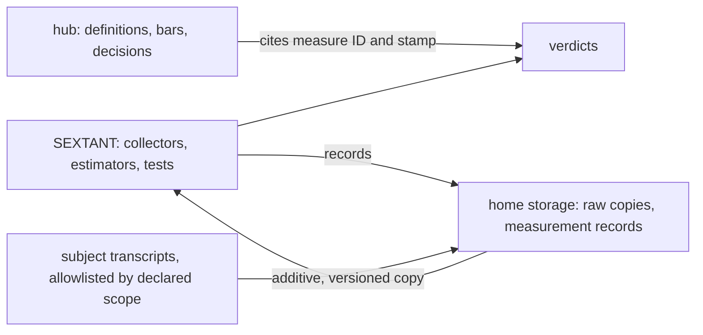

# Session: What OVERWATCH Was Missing, and CONOP SEXTANT: Measurement Leaves the Hub

**Date**: 2026-10-04 to 2026-10-05 (one session, on Nidhogg)
**Branch**: main
**Tags**: #session #doctrine #overwatch #docs #in-progress
**Documents**: [conop_sextant_doctrine_evaluation_repository.md](../plans/conop_sextant_doctrine_evaluation_repository.md), [conop_overwatch_claim_verification_and_irreversible_guards.md](../plans/conop_overwatch_claim_verification_and_irreversible_guards.md), [docs/gaps.md](../gaps.md), [docs/tasks.md](../tasks.md), [20261002_overwatch_release_entries_draft.md](../plans/20261002_overwatch_release_entries_draft.md), [20260830_home_storage_proposal.md](../reviews/20260830_home_storage_proposal.md)
**Implements**: [conop_overwatch_claim_verification_and_irreversible_guards.md](../plans/conop_overwatch_claim_verification_and_irreversible_guards.md) (Status Log 2026-10-05: MOE 1's subject and instrument); [conop_sextant_doctrine_evaluation_repository.md](../plans/conop_sextant_doctrine_evaluation_repository.md) (Wave 0 tasks 0a and 0c)
**References**: [20261005_sextant_proposer.md](../reviews/20261005_sextant_proposer.md), [20261005_sextant_review.md](../reviews/20261005_sextant_review.md), [ADOPTION.md](../../.claude/skills/maintaining-the-common-operating-picture/ADOPTION.md), [HOME-STORAGE.md](../../.claude/skills/lake-conventions/HOME-STORAGE.md), [traversing-the-knowledge-base/SKILL.md](../../.claude/skills/traversing-the-knowledge-base/SKILL.md), [verifying-claims/SKILL.md](../../.claude/skills/verifying-claims/SKILL.md), [20260827_stx_server_lessons_harvest.md](../reviews/20260827_stx_server_lessons_harvest.md)
**Follows**: [20261004_common_operating_picture_at_the_hub.md](20261004_common_operating_picture_at_the_hub.md)
**Cites**: `code.claude.com/docs/en/settings-reference.md`, `claude-directory.md`, `sub-agents.md`, `permissions.md` (raw pages, read 2026-10-05)

---

## Summary

The user asked what OVERWATCH was missing. A traversal of the plan's graph found six threads that had fallen between its documents, and one stale open item. The largest was that MOE 1 had no subject, no executable instrument, and no home.

The user then set the direction, over two days:
- This hub tracks what happened in other repos but does not maintain data.
- Nidhogg computes, and home storage is the system of record for personal data.
- MOE 1 measures `fist`, with `propter` as the fallback.
- Measures belong in one evaluation repository shaped like the `stx-server` trainer.

That became CONOP SEXTANT. It was debated blind, and both reviewers caught the lead's most dangerous error before anything acted on it: the advice to set `cleanupPeriodDays` to `0`, which the installed client rejects and older clients read as "write no transcripts". The user ruled on four questions. Retention is now `3650`, the NAS name is guarded, and MOE 1's instrument switches once its scorer passes A1. The plan is In Debate, awaiting approval.

| Metric | Value |
|---|---|
| Tests on `main`, start and end | 540 passed, both |
| Commits this session, before this doc | 4 (`810e931`, `1dffd87`, `c1c8e45`, `db2fba8`) |
| Review rounds | 1 blind round: `proposer` (8 findings), `code-reviewer` (3 Critical, 11 Warning, 16 Suggestion) |
| Lead claims the reviewer checked | 56: 43 hold, 5 refuted, 7 refuted in part, 1 cannot be re-run |
| Reviewer claims the lead refuted | 1 (`daily-weather` has a repo on disk) |
| Gaps opened | 3 (G8, G9, G10) |
| `/pcc` check 5 at close | 0 MISSING over 45 paths; the directory pass prints nothing |

---

## Work Completed

### 1. What OVERWATCH was missing

`KB-graph: lineage and both-direction neighbors of conop_overwatch_claim_verification_and_irreversible_guards.md (20 inbound files: the release draft, 5 session docs, 7 reviews, 2 skills, tasks, gaps, the propagation protocol, test_isolation.py) → six dropped threads and one stale open item; four filed as tasks, the plan's Status Log caught up with a backlink to the release draft, draft open item 2 closed`

The plan's Status Log had stopped at the Wave 2 gate on 2026-10-01, and the release draft linked to the plan without a link back. The six threads:

| Thread | Where it was handed off | Where it landed |
|---|---|---|
| MOE 1's measurement repo was never named | D6 and the MOE (plan lines 133, 158) | Now fist, by the user's ruling (section 2) |
| The `CI=true` line for the gate checklist | 1a gate, C3's fix | Nowhere but `ISOLATION.md:100`; filed P2 |
| The `uv cache clean` lesson | Status Log 2026-10-01, to task 1e | Neither 1e's Standard nor entry G; filed P2 |
| The Status Log itself | Through 2026-10-01 | Caught up in the 2026-10-05 entry |
| Task 2d's procedure | 2d names a scorer role and a method | No document holds either; filed P1, with Wave 0's |
| G4's collector | The gap register | No task line; filed P2 |

The stale item was the release draft's open item 2. Entry F's gate had returned GO in round 3, and the item is now closed.

### 2. Where the measure lives: the user's direction

`KB-graph: outbound from ADOPTION.md "Where things live" and HOME-STORAGE.md's routing rule → the hub cannot write personal data to home storage, since it declares no scope; this rejected Approach A and shaped D4`

The user's decisions, typed on 2026-10-04:
- **The hub's role.** It may track "another repo had so and so issue", but it "shouldn't be for data maintenance", which is the picture's failure the user had been fighting in `assay`.
- **Compute and storage.** Nidhogg is the compute terminal, and home storage is the system of record for personal data.
- **MOE 1's subject.** "Let's measure fist first. If necessary, let's measure propter."
- **Two shapes.** The user asked whether evaluation needs a repository for OVERWATCH alone or one built like the trainer; the lead recommended the trainer shape.

The lead saved the compute and storage split to its memory outside the repo. The NAS name stays out of committed text, by HOME-STORAGE's boundary line.

### 3. Transcript retention (G8), and the error behind it

Claude Code deletes transcripts, with their subagent files and tool results, once they are older than `cleanupPeriodDays`. The default is 30. Nothing on Nidhogg set it, and the oldest surviving transcripts were stx-server's from 2026-09-07, propter's from 09-13, and fist's from 09-15.

The lead's first reading came from a WebFetch summary: "Set it to `0` to turn off automatic deletion". It went into G8, the OVERWATCH entry, and SEXTANT's task 0a as a quotation of the docs. The lead also recommended `0` to the user. Both reviewers refuted it. The lead then re-fetched through the same summarizer and got the opposite reading, "`0` deletes transcripts immediately after each session ends". The raw page, fetched with `curl` as `.md`, says neither: "a whole number, minimum `1`", and "Setting `0` fails validation, so pick a large value such as `3650`". The installed 2.1.289 client carries the same rule, and its message says `0` "previously silently disabled all transcript writes". The user chose `3650`, which is now set.

### 4. CONOP SEXTANT: draft, blind debate, rulings, revision

The lead drafted the plan, committed nothing, and sent it to `proposer` and `code-reviewer` blind to each other.
- **`proposer`** returned SHIP-WITH-FIXES, with 8 findings. It also argued the repository is not yet earned.
- **`code-reviewer`** returned GO-WITH-FIXES: 3 Critical, 11 Warning, 16 Suggestion. Its C1 was the `0` value. C2 found the OVERWATCH entry stating an instrument change as decided before the user ruled. C3 found the exclusion a deny-list that would copy work material.
- **Independence.** The reviewer disclosed that it saw the opening of the proposer's hand-back while scanning this session's transcript.

The lead re-ran each finding before changing the plan. All held but two:
- **Refuted.** "`daily-weather` has no repo on disk": the repo is `~/projects/github/daily_weather`, which declares `scope: personal`, and its transcript directory encodes `_` as `-`.
- **Corrected.** W4's count of Appendix A rows naming a message to the user re-ran as 8, not 7. The finding stands.

The user's four rulings, through the harness's question tool, by the option labels chosen:
1. "Set 3650 now (Recommended)".
2. "Yes, once the scorer passes A1 (Recommended)".
3. "Now; scorer stays a spike (Recommended)".
4. "Add it and redact forward (Recommended)".

The revision:
- **D4** copies only exact matches to repos that declare `scope: personal`, with `assay` as a second-layer deny, and keeps the hub's transcripts off home storage.
- **D5** copies whole project trees under versioned names.
- **A1 and A2** move calibration onto fist, with the user's labels as ground truth.
- **D2 and D7** put the report root behind a role-named `.env` variable and render locally first.
- **Kill lines** now abandon the approach instead of patching it.
- **Evidence lines** sit under the plan's checkable claims.

The full record is in the plan's Status Log.

### 5. The NAS name and `/pcc` check 7

The NAS name was in 36 subject transcripts and on no list. On the user's ruling it joined the per-machine private-terms list. Check 7 matches terms as case-insensitive substrings across the tracked tree, so it then hit one committed file: the 2026-08-30 home-storage review, which named two variables after the host. `810e931` redacted them forward; git history keeps the old text, public since `8865c24`.

Adding the term had a side effect the lead found on re-run. A copy-time quarantine keyed to the whole list would now hold back 33 of stx-server's 37 transcript files and 19 of `daily_weather`'s 59. Which terms mark work material is SEXTANT's O6.

### 6. The register and the OVERWATCH entry

- **G8**: transcript retention, with the work terminal's likely loss. Under the default, the first 32 of the Insights report's 56 days are gone there.
- **G9**: the work-side overclaim rate, unmeasured once MOE 1 moved to fist.
- **G10**: whether fist runs sessions on other machines. 5 of its 15 session docs have no transcript on Nidhogg.
- **The OVERWATCH entry.** Revised in place before its first commit, it landed alone as `[gate]` (`db2fba8`). It records the subject, the instrument ruling and its condition, the timing change to about five weeks at fist's rate, the retention facts, and a correction note for the summarizer quote.

### 7. An observation for G7

This session's `/session-start` summary tagged all 11 of its lines. It restated no record's count as current: the task counts were measured by `grep` that turn, and the recent-work line was tagged as a record. G7 needs more sessions; it stays open.

---

## Claims

| Claim | State | Evidence |
|---|---|---|
| The suite passes on `db2fba8` plus this commit's task, gap, and draft edits | tested | `.venv/bin/pytest -q` → `540 passed, 1 warning in 5.52s` |
| The gap register holds rule 5 with G8, G9, and G10 | tested | `.venv/bin/pytest -q tests/unit/test_gaps.py` → `29 passed in 0.02s` |
| Nidhogg's user settings keep transcripts 3650 days, and no settings file on the box sets less | observed | `json.load` of `~/.claude/settings.json` → `cleanupPeriodDays 3650`; a grep over every user and project settings file on the box, `assay`'s excepted → `0` files below 3650 |
| The setting holds: the sweep keeps transcripts past 30 days | observed | UNVERIFIED: the first discriminating check is a session start on or after 2026-10-08, when stx-server's transcript dated 2026-09-07 passes 30 days; today it is present (`1` file dated 2026-09-07) |
| The installed client rejects `cleanupPeriodDays: 0` | observed, 2026-10-05 | `curl -sL https://code.claude.com/docs/en/settings-reference.md` → "a whole number, minimum `1`" and "Setting `0` fails validation"; `grep -a -c 'cleanupPeriodDays must be at least 1'` over the 2.1.289 client → `2` |
| No tracked file, tracked file name, or unpushed commit message holds a listed private term | observed, at `db2fba8` before this doc | check 7's scans over the index and 4 unpushed commits → `0` content-hit paths, `0` names, `0` message lines |
| The `[gate]` commit holds the OVERWATCH plan alone and only appends | observed | `git show --stat db2fba8` → `1 file changed, 8 insertions(+)` |
| fist has not adopted the kernel; 15 session docs; 10 top-level transcripts on Nidhogg | observed | `grep -c 'Claim Style'` → `0`; `ls docs/sessions/*.md \| wc -l` → `15`; `ls *.jsonl \| wc -l` in its transcript directory → `10` |
| The hub's own transcripts hold private terms | observed | count-only `grep -l -i -F -f` over the hub's 9 top-level transcripts → `4` before the NAS name joined the list, `5` after; this session's transcript names the NAS |
| Four OVERWATCH threads had not landed | observed, 2026-10-05, before the task lines were filed | `grep -l -i 'CI=true\|with and without'` over `.claude/agents/`, `commands/`, `teams/` → 0 files; `grep -c -i 'uv cache\|cache clean'` over the draft and tasks → 0; `grep -c 'M7\|\bG4\b' docs/tasks.md` → `0`; 2d's Standard read at plan line 206 |
| `/pcc` check 5 is clean | observed | file pass → 0 MISSING over 45 paths; directory pass → no output |

Overclaims the user caught this session: 0

Overclaims a reviewer caught this session: 12

The 12 are listed in Appendix A. The `0` claim reached the user as a recommendation, and the user held it pending; nothing relied on it, so it counts in M, not N.

---

## Key Decisions

| Decision | By | Rationale |
|---|---|---|
| MOE 1 measures fist, propter if necessary | the user, 2026-10-04 | Personal, active, no kernel yet; the work side already queues on one terminal |
| One trainer-shaped evaluation repository, not one per plan | the lead recommended; the user's rulings build on it | Plans end and their measures outlive them |
| Retention `3650`, never `0` | the user, 2026-10-05 | `0` fails validation now and stopped transcript writes in older clients |
| MOE 1 switches to one collector once A1 passes | the user, 2026-10-05 | Two instruments measure the switch between them; pre-kernel sessions have no `N` line |
| The repository now, the scorer as a spike | the user, 2026-10-05 | The copy is the riskiest code and deserves tests; the scorer is unproven |
| The NAS name on the list, redacted forward | the user, 2026-10-05 | 36 transcripts held it and no guard knew it |
| Revise the uncommitted OVERWATCH entry in place, with a correction note | the lead | Never published; the note keeps the error on record |
| Hub transcripts stay off home storage | the lead, as the default | The hub counts as work; crossing the line is the user's explicit call |

---

## Pillar Compliance

| Pillar | Status | Notes |
|---|---|---|
| **Simplicity First** | PASS, with a watch | SEXTANT adds a repository; D8 forbids a framework before the second measure, and the scorer stays a spike |
| **Shift-Left Testing** | N/A | No code changed; the register's test ran after each gap edit |
| **Config-Driven** | PASS | The plan names the report root by a `.env` variable, per HOME-STORAGE |

---

## Lessons

1. **A summarizer's quote is not a quote.** Two WebFetch summaries of one docs entry gave opposite answers, and the raw page gave a third. When a fact gates an action that is hard to undo, read the raw page and quote it with its location. Filed as the fourth `verifying-claims` trap candidate.
2. **A record that says "this box" is false on every other box.** The fleet-ledger task was written elsewhere and read here as current.
3. **Never decode a transcript directory name.** Claude Code encodes `_` as `-`, so `daily_weather` looked repo-less. Encode the checkouts and match instead.
4. **A deny-list fails open on the next unnamed project.** An allowlist by declared scope fails closed.
5. **One list, two jobs.** A private-terms list guards a public tree. As a copy-time quarantine it blocks personal data, unless it marks which terms are work terms.
6. **A reviewer that reads the session transcript can read the other reviewer.** Blindness between reviewers needs the hand-backs kept out of what a reviewer scans, or a disclosure like this round's.

---

## Commits

| Hash | Subject |
|---|---|
| `810e931` | [doc] Redact the home NAS name from the 2026-08-30 home-storage review |
| `1dffd87` | [doc] CONOP SEXTANT: an evaluation repository for doctrine measures, In Debate |
| `c1c8e45` | [doc] Gaps G8 (transcript retention) and G9 (the work-side overclaim rate) |
| `db2fba8` | [gate] OVERWATCH Status Log: MOE 1 measures fist; one collector for both windows once A1 passes |
| this doc's commit | [doc] Session 2026-10-05, with the task list, G10, and draft open item 2 |

---

## Next Steps

1. On or after 2026-10-08: confirm the retention setting holds (stx-server's 2026-09-07 transcript still listed).
2. The user writes the home-storage topology doc outside every checkout and repoints the roster (SEXTANT 0b); decide O6, the work-terms subset.
3. SEXTANT approval, with a second review round if the user wants one; then Wave 1 by 2026-10-23.
4. Before the next work-terminal visit: the procedure for OVERWATCH 0b to 0d and 2d, with G8's check first.
5. Hub-side, on Nidhogg: G4's test, the `CI=true` gate line, and the `uv cache clean` decision.
6. From before: `assay`'s adoption session, the 2026-10-04 entries' cycle, and slice 3.

---

## Appendix A: The Lead's Claims and Errors, by Who Caught Them

| # | Claim | Caught by | Correction |
|---|---|---|---|
| 1 | `cleanupPeriodDays: 0` turns deletion off, quoted as the docs, and recommended to the user | `proposer` (finding 1), `code-reviewer` (C1) | Minimum 1; `0` fails validation; `3650` set |
| 2 | Both MOE windows "are now scored" by one collector | `code-reviewer` (C2) | No collector existed and the user had not ruled; the user then ruled, conditional on A1 |
| 3 | The propagation exclusion "skips by name" | `code-reviewer` (claim 14) | It matches a relative path; the 2026-10-04 Appendix A had made the same correction |
| 4 | fist's first sessions are "gone through age-out" | `code-reviewer` (W5) | Older transcripts survive here; they ran elsewhere (G10) |
| 5 | Slice 3 renders the hub's suite, branch, and tools | `code-reviewer` (S7) | `/session-start` measures them; a slice 3 probe would take them |
| 6 | "OVERWATCH's Terrain" counts 173 transcripts | `code-reviewer` (claim 1) | Row A4 of its Assumptions |
| 7 | ADOPTION has three degenerate cases | `code-reviewer` (claim 7) | Four: a second clone or box was omitted |
| 8 | Three hub sessions run under the kernel | `code-reviewer` (claim 12) | Four carry the ledger; the omitted one holds the only `N = 1` |
| 9 | E1 to E6 carry known-bad references | `code-reviewer` (claim 16) | E4 and E5 name none |
| 10 | "Free-text claim detection misfires" | `code-reviewer` (S15) | OVERWATCH predicted that it "will misfire" |
| 11 | The trainer shape and propter's condition stated as the user's words | `code-reviewer` (S12) | The user raised two shapes; the condition is the lead's reading of "if necessary" |
| 12 | Home storage for measurements "as ADOPTION.md places them" | `code-reviewer` (S13) | ADOPTION requires outside every checkout; home storage is the user's decision |

Corrected by the lead before anyone relied on them, in neither count: "280 transcripts" offered for OVERWATCH 0d's Nidhogg half, which included `assay`'s files and subagent files; and "based on their last-modified date" in the summarizer's quote, which the raw page does not say.
